# Git 使用教學
本文記錄了Git常用指令。

## 什麼是Git?
Git是一個版本管控的程式，它可以幫我們管理專案的版本。概念上就好像我們在玩遊戲，我們拿到很稀有的道具，在這個時候保留一個存檔點，假如未來我們不小心弄丟那個道具，這時我們可以使用那個存檔點來救回弄丟的武器和道具。

Git在版本管控上不僅執行很快，而且有些版本管控的程式還需要架設伺服器才能使用，只要在電腦安裝Git這個小程式就能做版本管控。如果有興趣的話，可以去[維基](https://zh.wikipedia.org/wiki/Git)看看Git的說明。

最後，給一個小建議，雖然Git也有GUI介面，只要按按鈕就可以做版本管控，但是在學習怎麼使用Git時，最好還是在文字介面的終端機中敲敲鍵盤輸入指令。這麼做的確有點痛苦，可是熬過去後，在使用GUI版的Git時，才會比較明白每個按鈕背後到底做了哪些事情，否則Git管理的專案很有可能會亂成一團。

## 常用Bash指令
Windows上安裝Git通常都會額外安裝Bash，這支程式是命令列介面(Command-Line Interface, CLI)。這個程式允許使用者輸入指令來操作電腦，類似於Windows的CMD。Bash在Linux上算是常使用的程式。

下表列舉出Bash常用的指令。

指令      | 說明
----------|----------------------------------------------------------
cd        | 切換工作目錄
mkdir     | 建立目錄
pwd       | 顯示目前所在的位置
ls        | 顯示檔案列表
rm        | 刪除檔案
mv        | 搬移檔案
cp        | 複製檔案
touch     | 建立內容為空的新檔案

## 使用Git修改專案的設定
### 使用者設定
在開始使用Git管理專案之前，要先設定好使用者的名稱和Email。要先設定使用者名稱和Email的原因是，當一個專案有多個人在維護時，需要區分每次修改是由誰負責的，未來專案中出現錯誤時，比較容易找到問題點。

請開啟終端機，並且輸入下面兩行指令：
```bash
$ git config --global user.name "Joe"
$ git config --global user.email "joe@test.tw"
```
輸入完成後，就可以設定目前使用的電腦在Git管理專案的使用者名稱和Email，而且這個設定可用在該電腦上所有Git管理的專案。這裡提醒一下，那個字元`$`只是Bash終端機的提示字元，實際上下指令時，是要輸入字元`$`後面的那串文字才對。

如果只想針對一個Git管理的專案設定特定的使用者名稱和Email，可以使用下面的指令：
```bash
$ git config --local user.name "Joe"
$ git config --local user.email "joe@email.tw"
```
重點是`git config`後面接的參數`--global`，只要有這個參數，就可以修改全域的參數。在`git config`後面接`--local`就可以只針對當前的專案調整設定。

### 更換編輯器
使用Git管理專案時會需要使用編輯器，Git也允許使用者更換編輯器，以下面指令範例是把編輯器更換成Vim：
```bash
$ git config --global core.editor vim
```
Git預設使用的編輯器是Vim，如果有需要也可使用GUI的編輯器，像是Notepad++。不過，本文採用的編輯器會是Vim。

### 顯示當前專案更動的設定
修改完專案的設定，可以使用下面的指令來查看設定值：
```bash
$ git config --list
```

## 建立專案給Git管理
接下來我們來建立一個專案，並且使用Git來管理這個專案。我們先建立一個專案，第一步先建一個資料夾，用專案的名稱來為這個資料夾命名。我們以`testGit`來當作專案名稱，在終端機中可以輸入下面的指令來建立專案資料夾：
```bash
mkdir testGit
```
建立好之後就切換進`testGit`中，我們也可以在終端機中輸入指令來切換當前的目錄：
```bash
$ cd testGit
```

建立好專案並且進到專案資料夾後，我們需要使用下面的指令來初始化專案：
```bash
$ git init
```
使用上面的指令後，應該會發現專案的資料夾中會出現`.git`的目錄，這個目錄就是Git能對專案進行版本管控的關鍵。我們使用Git對專案版本管控時，就是把專案中每次改動都記錄到`.git`中。也就是說，**只要把`.git`目錄刪掉，Git就沒辦法再對該專案進行版本管控。**

## 讓Git接管檔案的版控
### Git管理檔案的機制
Git之所以能針對一個專案中每個檔案進行版本管控的原因在於，它在檔案的每一次更動中，比較當前更動的內容與更動前的內容之間的差異，然後把這個差異記錄下來，而不是儲存每次更動的內容。這麼做的好處是執行效率高，而且產生出來用於版本管控的檔案也比較小。

概念上就好像是先對檔案拍張完整的照片，每次內容有異動時只針對局部有變動的地方拍照，並記錄這些變動的位置。我們只需要記下這些變動的位置和變動的內容，就可以做到版本管控，而且這些變動資訊比起每次紀錄一份完整的檔案的照片少很多。也因為如此，我們實際上要保留的資訊可以很少，卻能做到版本管控。

Git在對檔案進行版本管控時，就如同把檔案在三個不同的區域中搬移，這三個區域如下：
- 工作目錄(Working Directory): 在這個區域下，我們可以編輯任何檔案，也可以新增檔案，也可以刪除檔案
- 暫存區(Staging Area): 在這個區域中，會存放已經更動過內容的檔案，也包含新增的檔案，需要使用`git add`才能把工作目錄下更動過的檔案搬移到這裡
- 儲存庫(Repository): 已經更動過內容的檔案最終存放的位置，需要使用`git commit`來把暫存區的檔案移動到這裡

在Git中目錄`.git`就是上述提到的儲存庫，網路上有些網站可能會使用`Repositotry`的縮寫`repo`來代表儲存庫。有了這三個區域，Git會以兩階段式來處理每個檔案：
- 第一階段： 在工作目錄下編輯檔案，在確定不再編輯時把這些編輯過的檔案都搬移到暫存區中
- 第二階段： 當我們已經把所有編輯過的檔案搬到暫存區，而且已經不再編輯同專案的其他檔案時，我們就要把檔案從暫存區搬移到儲存庫，並且留些訊息說明這次專案的變動有哪些檔案更動過，以及哪些內容更動過
  
### 確認檔案狀態:`git status`
Git管理專案中每個檔案時，我們都會使用如記事本之類的編輯器編輯程式碼，等確定編輯好了，就會讓Git幫我們儲存編輯好的檔案。我們可以使用下面的指令來確認當前專案下有沒有檔案更動過：
```bash
$ git status
```
如果照著本文下指令的話，目錄`testGit`中除了隱藏目錄`.git`以外，沒有其他檔案和資料夾，使用上面的`git status`會回報說沒有檔案更動過：
```bash
On branch master

No commits yet

nothing to commit (create/copy files and use "git add" to track)

```

現在我們嘗試建立一個檔案`Readme.md`，讓Git管理該檔案，該檔案的內容如下：
```
Hello world!
This is Readme.md
```
此時目錄`testGit`中就存在一個檔案`Readme.md`，如果我們輸入`git status`，就會得到下面的訊息：
```bash
On branch master

No commits yet

Untracked files:
  (use "git add <file>..." to include in what will be committed)
        Readme.md

nothing added to commit but untracked files present (use "git add" to track)

```
上面的訊息中最重要的是`Untracked files`，在這行下面會列出檔名`Readme.md`，這是要告訴我們到目前為止檔案`Readme.md`是**未追蹤**中的，它要求我們使用`git add`和`git commit`把該檔案放進儲存庫中，讓Git可以持續追蹤該檔案的狀態。

我們再做一個實驗，先建立一個空的目錄，然後查看狀態：
```
$ mkdir test

$ git status
On branch master
nothing to commit, working tree clean

```
回報的訊息說沒任何東西需要搬移到暫存區，我們已經建立新的目錄，為什麼Git卻沒要求我們把目錄`test`放進儲存庫呢？這是因為Git只在意檔案內容的變動，而不會管目錄底下的變化，所以我們建立目錄`test`時，Git才會沒察覺該目錄的存在。

現在我們試試看，在目錄`test`中建一個空檔案，然後查看狀態：
```bash
$ touch test/.file

$ git status
On branch master
Untracked files:
  (use "git add <file>..." to include in what will be committed)
        test/

nothing added to commit but untracked files present (use "git add" to track)
```
在我們建立空檔案`.file`之後，Git就查覺到目錄`test`的存在。假如我們想把目錄放到儲存庫中，讓Git可以管控，我們可以先建一個空檔案，然後使用`git add `和`git commit`來放進儲存庫中。現在我們還是先把目錄`test`刪除掉：
```bash
$ rm -rf test
```

### 讓Git管理檔案的版本:`git add`
我們在前一小節中建立了檔案`Readme.md`，也使用`git status`確認過，`Readme.md`還沒讓Git幫我們管理。那麼我們該如何讓Git管理新檔案呢?

我們可以需要先使用`git add`把檔案放進暫存區中，該指令用法如下：
```bash
$ git add <filepath>
```
`filepath`是我們想讓Git管理的檔案路徑，現在我們只有一個檔案`Readme.md`需要讓Git管理，我們可使用下面的指令：
```bash
$ git add Readme.md
```
使用上面的指令後，我們使用`git status`來確認看看當前專案的狀態：
```bash
On branch master

No commits yet

Changes to be committed:
  (use "git rm --cached <file>..." to unstage)
        new file:   Readme.md

```
從上面的訊息中`Changes to be committed:`這行以及下面列出的檔名告訴我們，我們成功把檔案`Readme.md`放到暫存區中。

假如我們修改了多個檔案，或是新增多個檔案時，比方說有十個檔案，難道我們就要連續使用`git add`十次嗎?其實可以不必這麼麻煩，我們可以使用下面的指令，git會幫我們找出所有新建的檔案，以及已經修改過的檔案，然後把這些檔案放進暫存區中：
```bash
$ git add .
```
上面指令中最關鍵的是`.`，在Bash中`.`代表當前目錄的意思，我們把它當作`<filepath>`給`git add`使用，就能一次把所有修改過和新增過的檔案放進暫存區中。

### 提交檔案的更動訊息:`git commit`
我們使用`git add`把變更過的檔案搬移到暫存區，並不代表該檔案已經讓Git管理，我們還需要使用`git commit`來把這次的更動提交出去，指令`git commit`用法如下：
```bash
git commit
# -m <message> :    直接提交這次的更動訊息，後面的<message>就是用來說明這次更動了哪些檔案和更動的原因
# --amend :         使用前一次的提交的更動訊息
```
上面只列出`git commit`常用的兩個參數，其中使用`-m`時後面可以直接輸入這次更動的訊息，但是如果不使用這個參數，Git會開啟編輯器，我們就需要在編輯器輸入更動的訊息。參數`--amend`的用途是直接使用前一次提交的更動訊息，來提交這次的更動。

接下來我們用範例來說明這兩個參數的功能。如果上一小節的範例指令都用照做，暫存區應該會有`Readme.md`，現在我們使用`git commit`來提交這次的更動訊息：
```bash
$ git commit -m "Init commit"
[master (root-commit) 355a48c] Init commit
 1 file changed, 2 insertions(+)
 create mode 100644 Readme.md
```
在輸入完畢，Git就會把`Readme.md`和訊息`Init commit`一併放進儲存庫中。

如果要提交的訊息非常長，可以只使用`git commit`，此時就會跳出編輯器，只要在編輯器中輸入完訊息並且儲存，然後關閉編輯器，Git就會提交這次的訊息。至於Git會跳出什麼樣的編輯器，則依據Git的設定而定，預設使用vim，當然也可以更換編輯器，更換方式請參考[更換編輯器](#更換編輯器)。

接下來用範例來說明參數`--amend`的功能。首先，我們再建立一個檔案`test.txt`，然後使用帶有參數`--amend`的`git commit`：
```bash
$ touch test.txt
$ git add test.txt
$ git commit --amend
[master 9eee82b] Init commit
 Date: Thu Feb 17 10:55:07 2022 +0800
 2 files changed, 2 insertions(+)
 create mode 100644 Readme.md
 create mode 100644 test.txt

```
上面第一行指令在Bash中是用來產生空檔案，下一行指令輸入完畢，會跳出一個編輯器，上面會顯示上一次提交的訊息，也就是`Init commit`這個訊息。當我們儲存畢關閉編輯器時，更動訊息`Init commit`除了包含前面建立的`Readme.md`以外，還有剛剛新增的檔案`test.txt`。後續還會說明`--amend`適合的情境。

接下來說明一下，使用`git commit`時一定要輸入訊息的原因，以及需要輸入什麼樣的訊息才行。`git commit`會要求一定要輸入訊息，否則不會讓我們提交當前更動的檔案到儲存庫裡，原因在於讓我們更方便管理專案。

假設我們在在某個程式碼裡加了幾行程式，那麼我們要如何知道這幾行新加的程式碼的功能呢?雖然我們可以寫些註解來說明那幾行程式碼的功能，也許是為了修正某個BUG，但是有時註解未必能很直接了當的說明新加的程式碼的功能，這個時候我們反而要多浪費時間分析程式碼，又或是執行那段程式碼才明白它的功能。就算那段程式碼是我們自己寫的，可是只要有相當長的時間沒接觸，也可能會忘記。

在這種情況下，既然我們已經使用Git來管理專案了，我們就可以使用更簡單的方法來解決，那就是使用`git commit`提交訊息到儲存庫中。只要用很簡短又明確的訊息來說明，以後我們只要看了這段訊息就知道新加的程式碼的用途，以及什麼時候加了那幾行程式碼。

至於應該要提交什麼樣的訊息，這點只要能用文字明確描述這次提交的訊息中，有哪些檔案更動過，以及為何要更動就可以了。其實只要自己看得懂，提交什麼樣的訊息都可以，當然如果有其他人也共同維護，其他人也最好能看得懂。雖然前面的範例輸入的訊息是英文，其實也可以使用中文。

### 查看歷史紀錄: `git log`
在上一小節中，我們已經把`Readme.md`和`test.txt`提交到儲存庫中，接下來該說明如何查閱我們先前提交的資訊。我們可以使用`git log`來查閱提交的資訊，該指令用法如下：
```bash
$ git log
# --oneline:  每一個提交訊息只以一行顯示
# --graph:    以圖形的方式來呈現
```
`git log`有兩個參數可以使用，第一個參數`--oneline`會把每個提交訊息以一行來顯示，如果想快速查看提交的歷史紀錄，這個會很好用。第二個參數`--graph`則會以文字的方式，來呈現完整的歷史紀錄，其實與直接使用`git log`顯示出來的資訊類似，稍後我們用範例來說明這兩者之間的差異。

現在我們使用`git log`來看看專案`testGit`提交訊息的歷史紀錄。
```bash
$ git log
commit 9eee82b4d028aa45f30913421708efd801938062 (HEAD -> master)
Author: Joe <joe@email.tw>
Date:   Thu Feb 17 10:55:07 2022 +0800

    Init commit
```
`git log`會顯示的資訊有幾個，我們一個一個了解吧。第一行`commit`後面接的那段`74d7f90a2d21fc56fb59efda49252972d6e3888b`是一組十六進位的數字，它是使用SHA-1(Secure Hash Algorithm 1)演算法計算出來的結果，這組數字可以看做是一個編號，在這裡它代表這個提交訊息的編號，後面會詳細說明。在第一行最後面`(HEAD -> master)`，這個也暫時先不管，後面再詳細說明。第二行則顯示提交這個訊息的作者和Email。第三行則是顯示提交這個訊息的時間，最下面的則是這個提交的訊息。

如果我們只想快速查看提交訊息的歷史紀錄和SHA-1的編號，我們可以這樣使用`git log`：
```bash
$ git log --oneline
9eee82b (HEAD -> master) Init commit
```
我們可以看到`git log`會以一行的方式來顯示一個提交的訊息，這包刮SHA-1的編號和訊息。

接下來我們來說明參數`--graph`對`git log`會有什麼樣的輸出資訊。在說明之前，我們再加入一個空檔案`cat.txt`，並提交一次訊息。
```bash
$ touch cat.txt
$ git add .
$ git commit -m "Add cat.txt"
[master b9cd707] Add cat.txt
 1 file changed, 0 insertions(+), 0 deletions(-)
 create mode 100644 cat.txt
```
然後我們再編輯`test.txt`，並且提交一次訊息。`test.txt`的內容如下：
```
This file is test.
```
接著，我們使用`git add .`來把`test.txt`加進暫存區中，然後使用`git commit`來提交訊息，當Git跳出編輯器時，請輸入下面的訊息：
```
Update test.txt

Update test.txt
```
在做完這些事之後，我們來看看提交訊息的歷史紀錄吧。
```bash
# 使用 git log 來顯示歷史紀錄
$ git log
commit a8b412ecc331c7df85df9c1f6cec2e6a9d092283 (HEAD -> master)
Author: Joe <joe@email.tw>
Date:   Thu Feb 17 13:51:59 2022 +0800

    Update test.txt

    I update test.txt.

commit b9cd7079788b33a7e4191c990a276c59b668e87d
Author: Joe <joe@email.tw>
Date:   Thu Feb 17 11:58:31 2022 +0800

    Add cat.txt

commit 9eee82b4d028aa45f30913421708efd801938062
Author: Joe <joe@email.tw>
Date:   Thu Feb 17 10:55:07 2022 +0800

    Init commit

# 使用git log --graph
$ git log --graph
* commit a8b412ecc331c7df85df9c1f6cec2e6a9d092283 (HEAD -> master)
| Author: Joe <joe@email.tw>
| Date:   Thu Feb 17 13:51:59 2022 +0800
|
|     Update test.txt
|
|     I update test.txt.
|
* commit b9cd7079788b33a7e4191c990a276c59b668e87d
| Author: Joe <joe@email.tw>
| Date:   Thu Feb 17 11:58:31 2022 +0800
|
|     Add cat.txt
|
* commit 9eee82b4d028aa45f30913421708efd801938062
  Author: Joe <joe@email.tw>
  Date:   Thu Feb 17 10:55:07 2022 +0800

      Init commit


```
有注意到`git log`和`git log --graph`顯示資訊的差異吧。當我們使用`git log`時，得到的是完整的每筆提交的訊息，其中包括SHA-1的編號、提交的作者與Email和提交的訊息。然而，我們使用`git log --graph`時，除了得到跟`git log`相同的資訊以外，最右邊還會有`*`和`|`構成的圖形，這個圖形可以想像成時間線，每個`*`標示的都是提交訊息的時間點。未來提到分支(branch)時，`git log --graph`有時就想看分支之間的關係就會很好用。

上面的範例中再補充一點，我們在`test.txt`中輸入了文字，並且在提交時輸入了兩行訊息，這兩行中還多了一行空行。有時我們可能是為了解決某個BUG，而需要修改很多檔案，我們提交訊息時最好完整點，以後在查看時會比較清楚這次修改了什麼，又為了解決什麼問題而修改。以我們修改`test.txt`為例，我們在提交訊息的第一行可以看做是標題，第三行則是用更完整說明我們對`test.txt`做了哪些事，而第二行的空行則用來區隔標題與詳細內容。

### 檔案的刪除與重新命名和搬移
交給Git管控的檔案也可以刪除掉，當然也可以重新命名。

#### 刪除檔案
我們先從檔案的刪除說起好了，我們有三個方法可以刪除檔案，第一個方法是直接在檔案總管上刪除檔案，第二個方法則是使用Bash提供的指令來刪除檔案。現在我們使用指令來刪除掉檔案`cat.txt`：
```bash
$ rm [-rf] 檔名或目錄
# -r  : 主要用於刪除目錄以及該目錄下的子目錄和檔案
# -f  : 強制刪除的意思，會無視任何情況直接刪除

$ rm cat.txt
```
至於第三個方法則是使用Git提供的指令來幫我們刪除檔案，這個指令就是`git rm`，用法有點類似Bash的`rm`，用法如下：
```bash
$ git rm [-rf] [--cached] 檔案或目錄
# -r        : 主要用來刪除一個目錄
# -f        : 強制刪除的意思，使用了它就會什麼都不管就把檔案和目錄刪除掉，這個要小心使用
# --cached  : 用來把檔案從Git的儲存庫中移除，並不是真的要刪除檔案
```
有用過Bash的`rm`就會知道，在不使用`-r`的情況下只能刪除檔案，如果想刪除掉一整個目錄，就要使用`-r`，這個時候包括該目錄下所有的子目錄和檔案都會全部被刪除。至於那個`-f`，有時刪除檔案可能會因為某些原因而導致沒辦法刪掉，這個時候就可以使用這個參數來強制刪除。最後的`--cached`則不會真的刪除檔案，它只是把檔案從Git的儲存庫中移除，該檔案就不再被Git管控，但是該檔案還是存在的。

接下來用範例說明如何刪除檔案。我們就用`rm`來刪除檔案`cat.txt`，然後看看當前專案的狀態吧。
```bash
$ rm cat.txt
$ git status
On branch master
Changes to be committed:
  (use "git restore --staged <file>..." to unstage)
        deleted:    cat.txt
```
在刪除檔案以後，使用`git status`查看專案的狀態，可以發現Git告訴我們有檔案刪除。這裡要解釋一下，對Git來說刪除檔案也是一種檔案的更動，也就是檔案的狀態本來是存在的，而現在則消失了。因為檔案被刪除也被視為是一種檔案的更動，所以我們當然要把這個更動提交度到儲存庫裡：
```bash
$ git add .
$ git commit -m "Delete cat.txt"
[master 395bee4] Delete cat.txt
 1 file changed, 0 insertions(+), 0 deletions(-)
 delete mode 100644 cat.txt
```
這邊要提一下`git rm`和`rm`之間的差別，當我們使用`rm`刪除檔案時，需要使用`git add .`把檔案的刪除狀態搬移到暫存區中，然後使用`git commit`來提交到儲存庫中。可是當我們使用`git rm`時，這個動作相當於`rm`和`git add .`這兩個指令都做。也就是說，如果不想下這麼多指令，可以直接使用`git rm`，然後使用`git commit`提交到儲存庫，就可以把檔案刪除掉。

我們再來談談`git rm --cached`，有時我們已經把一個檔案提交到Git的儲存庫上了，事後才發現這個檔案不應該讓Git管控，可是這個檔案也許是程式碼運作時需要用到，不應該被刪除掉，這個時候我們就可以使用`git rm --cached`來幫我們刪除檔案。接下來我們就用範例來說明吧，我們先建一個檔案`tmp.txt`，然後把這個檔案提交到儲存庫裡。
```bash
$ touch tmp.txt
$ git add tmp.txt
$ git commit -m "Add tmp.txt"
[master 4913011] Add tmp.txt
 1 file changed, 0 insertions(+), 0 deletions(-)
 create mode 100644 tmp.txt
```
現在我們來刪除檔案吧，然後查看專案的狀態：
```bash
$ git rm --cached
$ git status
On branch master
Changes to be committed:
  (use "git restore --staged <file>..." to unstage)
        deleted:    tmp.txt

Untracked files:
  (use "git add <file>..." to include in what will be committed)
        tmp.txt
```
Git告訴我們`tmp.txt`已經刪除了，可是還有一個檔案`tmp.txt`不是追蹤狀態。我們可以從檔案總管查看`tmp.txt`是不是還存在，我們也可以使用Bash提供的指令來查看：
```bash
$ ls -l
-rw-r--r-- 1 JH-06 197121 28 Feb 17 10:54 Readme.md
-rw-r--r-- 1 JH-06 197121 19 Feb 17 13:51 test.txt
-rw-r--r-- 1 JH-06 197121  0 Feb 17 16:14 tmp.txt
```
檔案`tmp.txt`因`git rm`使用參數`--cached`而沒真的刪除掉，只是從儲存庫中被移除掉，所以Bash的指令`ls`和檔案總管都還看得到。現在，我們還是把`tmp.txt`加回去吧。
```bash
$ git add tmp.txt
$ git status
On branch master
nothing to commit, working tree clean
```

#### 重新命名和搬移
檔案的重新命名也是一種變更，這邊也有三個方法可以更改檔名，第一個方法就跟刪除檔案一樣，直接在檔案總管上處理，第二個方法就是使用Bash指令的`mv`來改檔名。我們用`mv`來更改`test.txt`的檔名：
```bash
$ mv 原始檔名 新檔名或路徑
# 原始檔名      : 想要重新命名或搬移的檔名
# 新檔名或路徑  : 若是一個在當前目錄下不存在的檔名，則對原始檔案更改名稱，
#                 假如是一個路徑，則會把原始檔案搬過去，相當於在檔案總管中把檔案剪掉並貼到新的目錄中

$ mv test.txt bird.txt
```
我們來看一下當前的狀態是如何：
```bash
$ git status
On branch master
Changes not staged for commit:
  (use "git add/rm <file>..." to update what will be committed)
  (use "git restore <file>..." to discard changes in working directory)
        deleted:    test.txt

Untracked files:
  (use "git add <file>..." to include in what will be committed)
        bird.txt

no changes added to commit (use "git add" and/or "git commit -a")

```
我們從上面的訊息中可以得知，當我們更改檔名時，對Git來說這相當於兩個動作，第一個是刪除檔案`test.txt`，然後建立一個新檔案`bird.txt`。

至於檔案的重新命名的第三個方法，就跟刪除檔案一樣，Git也提供指令來達成這件事，而且這個指令相當於`mv`與`git add .`的結合。也就是說，使用Git提供的指令來更改檔名，我們可以少使用一個指令。這個指令的用法如下：
```bash
$ git mv [-f] 原始檔案 新檔名或路徑
# -f  : 有強制的意思，會無視不能改名的情況
```
就跟`git rm`類似，在某些情況下我們沒辦法更改檔名，這個時候就可以使用參數`-f`來強制改名。

這邊再提一點，不論是`mv`或是`git mv`除了可以用來更改檔名以外，只要在原始檔名後面接的不是檔名，而是一個路徑，則該檔案就會搬移到所指定的路徑。我們先建一個目錄`tmp`，然後試著使用`git mv`把檔案`tmp.txt`搬到目錄`tmp`中吧。
```bash
$ mkdir tmp

$ git mv tmp.txt tmp

$ git status
On branch master
Changes to be committed:
  (use "git restore --staged <file>..." to unstage)
        renamed:    tmp.txt -> tmp/tmp.txt

Changes not staged for commit:
  (use "git add/rm <file>..." to update what will be committed)
  (use "git restore <file>..." to discard changes in working directory)
        deleted:    test.txt

Untracked files:
  (use "git add <file>..." to include in what will be committed)
        bird.txt
```
我們使用`git status`查看狀態，可以得知兩件事，第一件事是我們先前把`test.txt`改名為`bird.txt`，第二件事是`tmp.txt`改名為`tmp/tmp.txt`。對Git來說搬移檔案也算是重新命名，可以這樣思考，原本檔名`tmp.txt`改成`tmp/tmp.txt`，只是對我們來說這個動作是把檔案搬到目錄`tmp`中。

最後，我們把這兩個動作都提交到儲存庫中吧：
```bash
$ git add .

$ git status
On branch master
Changes to be committed:
  (use "git restore --staged <file>..." to unstage)
        renamed:    test.txt -> bird.txt
        renamed:    tmp.txt -> tmp/tmp.txt


$ git commit -m "Rename test.txt -> bird.txt and Move tmp.txt into directory tmp"
[master cf04238] Rename test.txt -> bird.txt and Move tmp.txt into directory tmp
 2 files changed, 0 insertions(+), 0 deletions(-)
 rename test.txt => bird.txt (100%)
 rename tmp.txt => tmp/tmp.txt (100%)
```
在我們使用`git add .`之前，使用`git status`可以看到本來`test.txt`回報說被刪除並建立新的檔案`bird.txt`，可是使用了`git add .`則回報說`test.txt`重新命名為`bird.txt`。

### 讓Git忽略檔案: `.gitignore`
在開發專案時，有時候我們把某些檔案放進儲存庫中讓Git管控，事後想想這些檔案不應該給Git管控。那些檔案可能含有像是帳密這類機密資訊，也可能那些檔案是程式碼需要用到的設定檔而導致更改的頻率很高，又或是建置專案與程式碼產生的臨時檔案。

Git也有辦法忽略掉我們不想管控的檔案，方法是建立檔案`.gitignore`，在這個檔案中制訂規則來忽略掉我們不想讓Git管控的檔案，然後使用`git add`指令把該檔案加到儲存庫中。我們先建立檔案`config.cfg`，然後查看狀態：
```bash
$ touch config.cfg

$ git status
On branch master
Untracked files:
  (use "git add <file>..." to include in what will be committed)
        config.cfg

nothing added to commit but untracked files present (use "git add" to track)
```
因為我們還沒建立`.gitignore`，所以Git查覺到有檔案建立出來。現在我們先建立檔案`.gitignore`：
```bash
$ touch .gitignore
```
接下來我們在`.gitignore`中加入一條規則來忽略掉`config.cfg`，請在`.gitignore`中填入下面的內容：
```
config.cfg
```
現在我們來看看Git是否能夠察覺`config.cfg`，並要求我們要提交到儲存庫：
```bash
$ git status
On branch master
Untracked files:
  (use "git add <file>..." to include in what will be committed)
        .gitignore

nothing added to commit but untracked files present (use "git add" to track)
```
看到了吧，當我們把`config.cfg`寫進`.gitignore`中，Git就會忽略掉`config.cfg`，可是`.gitignore`是新建的檔案，所以Git會要求我們提交到儲存庫中。

我們再來思考一個情況，假設我們要開發一套遊戲程式，這套遊戲程式需要使用`config.cfg`來維護程式某些設定，而且考慮到`config.cfg`有可能會一時失誤亂設定，這個時候我們需要準備`default.cfg`來當作用來初始化的設定檔，讓程式的設定恢復最初的狀態。也許未來還要根據不同的情境準備多個不同的設定檔，說不定會有10多個設定檔，難道我們要一一列舉出來才能讓Git忽略掉嗎?其實可以不必這麼做，雖然這些設定檔的檔名都不同，但我們知道這些設定檔都有一個共通點，那就是副檔名都是`.cfg`。這個時候我們可以搭配萬用字元`*`和附檔名`.cfg`來組成一個忽略規則，來讓Git忽略掉附檔名為`.cfg`的所有檔案，現在我們把`.gitignore`的內容改成下面：
```
*.cfg
```
接著，我們測試看看Git能不能忽略掉`config.cfg`，然後再測試看看我們再建立一個檔案`default.cfg`，看看Git能不能忽略掉`default.cfg`：
```bash
$ git status
On branch master
Untracked files:
  (use "git add <file>..." to include in what will be committed)
        .gitignore

nothing added to commit but untracked files present (use "git add" to track)

$ touch default.cfg

$ git status
On branch master
Untracked files:
  (use "git add <file>..." to include in what will be committed)
        .gitignore

nothing added to commit but untracked files present (use "git add" to track)
```
我們修改了`.gitignore`的內容，Git還是照樣能夠忽略掉`config.cfg`，而且因為我們使用萬用字元`*`，所以`default.cfg`也會被忽略掉。

現在我們來試試看忽略掉目錄`tmp`中的`tmp.txt`，我們在`.gitignore`中再加入一行：
```
tmp/tmp.txt
```
然後我們在`tmp/tmp.txt`中輸入下面的內容：
```
This is tmp file.
```
接下來查看專案的狀態：
```bash
On branch master
Changes not staged for commit:
  (use "git add <file>..." to update what will be committed)
  (use "git restore <file>..." to discard changes in working directory)
        modified:   tmp/tmp.txt

Untracked files:
  (use "git add <file>..." to include in what will be committed)
        .gitignore

no changes added to commit (use "git add" and/or "git commit -a")
```
`git status`回報說`.gitignore`是未追蹤的狀態，這個很正常，因為我們還沒提交到儲存庫中，可是奇怪的是Git卻說`tmp/tmp.txt`已經修改了。我們已經修改`.gitignore`來忽略掉`tmp/tmp.txt`，為什麼我們修改了這個應該要被忽略的檔案，Git卻還會持續追蹤這個檔案的狀態呢？

會有這個狀況是因為在我們把`tmp/tmp.txt`忽略掉的這條規則加到`.gitignore`中之前，就已經提交到儲存庫中。也就是說，Git只會在`.gitginore`加入忽略條件之後，才會這條忽略條件生效。如果在`.gitignore`加入忽略條件之前，就已經把需要忽略的檔案提交到儲存庫，那麼這些檔案就不會被忽略掉。在這種情況下，我們需要先編輯好`.gitignore`，然後使用`git rm --cached`來把應該要被忽略掉的檔案從儲存庫中移出，我們來試試看移除`tmp/tmp.txt`：
```
$ git rm --cached tmp/tmp.txt

$ git status
On branch master
Changes to be committed:
  (use "git restore --staged <file>..." to unstage)
        deleted:    tmp/tmp.txt

Untracked files:
  (use "git add <file>..." to include in what will be committed)
        .gitignore
```
可以看到使用`git rm --cached `幫我們把`tmp/tmp.txt`從儲存庫中移除。我們來把`.gitignore`提交到儲存庫中，請確認`.gitignore`的完整內容跟下面的一樣：
```
*.cfg
tmp/tmp.txt
```
然後我們把`.gitignore`提交到儲存庫中：
```bash
$ git add .

$ git commit -m "Add .gitignore"
[master 7f707c6] Add .gitignore
 2 files changed, 2 insertions(+)
 create mode 100644 .gitignore
 delete mode 100644 tmp/tmp.txt
```
在做完上面的動作以後，不管我們怎麼修改`tmp/tmp.txt`的內容，Git也不會理會。假如不想保留任何要被Git忽略的檔案，也可以直接使用下面的指令：
```bash
$ git clean -fX
# -f  : 強制的意思
# -X  : 會依據.gitignore的規則來忽略掉的規則來刪除掉所有在專案中的檔案
```
使用上面的指令會根據`.gitignroe`的規則，可以一勞永逸的刪除掉所有要被忽略掉的檔案。這邊提醒一下，請確定真的要刪除掉所有需要忽略掉的檔案，否則等指令執行完了，可能就沒辦法救回那些被刪掉的檔案。

還需要提一點，只要被忽略的檔案曾經被提交到儲存庫中，即使編輯`.gitignore`並使用`git rm --cached`將其移出儲存庫，雖然Git不會再追蹤其狀態，但是在儲存庫中還是存在這些檔案。如果這些檔案非常大，目錄`.git`就會比較肥，後面會有一個小節會說明如何處理這個問題。

最後，我們統整一下編輯`.gitignore`忽略規則的幾個注意事項：
- 以一行為一個單位來制定一條規則，來忽略掉單一或多個檔案
- 若以檔名來當作一條忽略規則，Git只會忽略掉這個檔名
- 萬用字元`*`可以代表0到任意多個字元，可以搭配路徑和副檔名來忽略掉特定規則的檔案
- `#`是單行註解的符號，只要有這個符號，該符號後面的文字都會被Git忽略掉
- 只對新增規則以後的檔案才會被忽略
- 若在新增忽略規則之前就已經把檔案提交到儲存庫中，就需要事後使用`git rm --cached`或`git clean -fX`來把需要忽略的檔案移除掉
  
我們就拿下面的`.gitignore`的內容為例，來說明上面的注意事項：
```
# 忽略掉所有副檔名為.cfg的檔案
*.cfg

# 忽略掉目錄tmp的tmp.txt
tmp/tmp.txt
```
這邊列舉出上面範例的幾個重點：
- 第一行和第四行是註解，說明下一行的忽略條件的用途
- 第二行中因為萬用字元`*`可以代表任意的檔名，也可以包含某些目錄，所以只要副檔名為`.cfg`的檔案都會被忽略掉，就算這些檔案存在於專案目錄下的任何一個子目錄都會被忽略
- 最後一行只針對目錄`tmp`底下的`tmp.txt`制定忽略規則，也就是說這條規則只忽略掉這個特定的檔案

## 分支(Branch)
在本章節中將會介紹什麼是分支(Branch)，以及如何使用分支來管控專案。

### 何謂分支?
在科幻電影裡，主角會使用時光機器進行時光旅行，來到某個重要的分歧點。在這個重要的分歧點，主角的父母因沒買到彩券並中獎，而讓他們一家人過得非常困苦。主角第一次來到這個重要的分歧點，他誘使他的父母購買彩券，但是卻被壞人盯上，結果獎金被壞人搶走。這個時候產生了一個新的時間線，在這個時間線中雖然主角的父母中大獎，卻因獎金被搶走而過得很慘。主角第二次來到重要分歧點，而這次他不僅又使父母買彩券並中獎，還設法阻止壞人搶走獎金。這次又產生了一個時間線，在這個時間線中主角和父母用這筆獎金過得幸福美滿。

分支就類似於上面例子提到的時間線，雖然我們沒有時光機器，但是我們可以使用Git來幫我們管理專案時，在重要的分歧點上建立一個新的分支，甚至還可以建立多個分支，然後做我們想要達成的事情。那麼，分支在什麼情況下可以派上用場呢?

比方說我們在開發一個遊戲程式，在這遊戲中使用了我們自己設計的數學公式來模擬重力，但是因為當初沒設計好，導致計算過程比較耗時。也許我們經過分析後，發現只要修改數學公式，並且使用新的實作方式就可以讓計算過程更快，而且模擬重力的結果跟修改之前的一樣，但是我們不確定這麼做是否可行。這個時候我們就可以建立一個新的分支，在這個新的分支上嘗試實作新的方法。只要測試結果是對的，就保留這個新的分支，並且與原有的程式碼整合起來，就算失敗了，也不會影響到原有的程式碼。

### 建立與切換分支: `git branch`, `git checkout`
當我們想建立一個新的分支時，可以使用`git branch`，用法如下：
```bash
$ git branch <new_branch>
# <new_branch>  : 新分支的名稱

$ git branch
# 用於顯示所有的分支
```
使用`git branch`建立分支時，只要在該指令後面輸入分支的名稱即可。基本上分支名稱沒有什麼限制，唯一的限制是不能包含空格。`git branch`主要的用途是管理分支，除了剛剛提到可以建立新分支以外，還可以只使用`git branch`會顯示專案中所有的分支。當然，`git branch`也能夠修改現有分支的名稱，甚至可以刪除已經存在的分支：
```bash
$ git branch -m <old_branch> <new_branch>
# -m            : 用於修改分支的名稱
# <old_branch>  : 已經存在分支的名稱
# <new_branch>  : 新的分支名稱

$ git branch [-d|-D] <branch>
# -d        : 用於刪除已經存在的分支
# -D        : 類似-d，但是會強制刪除
# <branch>  : 欲刪除的分支名稱
```
這裡提一下，`|`代表兩個參數中只能選一個來使用。使用`git branch -m`修改分支名稱時，後面接的`<old_branch>`必須是已經存在的分支，而`<new_branch>`則必須是不存在的分支名稱才行。在刪除分支時，所使用的分支當然也必須是已經存在的。而`git branch -d`和`git branch -D`之間的差別在於，後者會無視任何情況，直接刪除掉分支，而前者在遇到一些狀況時會中只刪除的動作。

當我們建立好分支後，就應該要切換到新的分支中，去完成這個新分支的工作。我們可以使用`git checkout`來切換分支，用法如下：
```bash
$ git checkout [-b] <branch_name>
# -b            : 當切換的分支不存在時，會建立新的分支
# <branch_name> : 欲切換過去的分支名稱
```
當我們直接使用`git checkout`時可以切換到已經存在的分支，切換過去時。這裡要提一下，當我們使用`git checkout -b`時，只要後面接的分支名稱不存在，Git就會幫我們先建立好，然後切換過去，就相當於先執行`git branch`建立新分支後，執行`git checkout`切換分支。

在大致說明用法以後，接下來用範例來體會一下這些指令的功能吧。我們先建立新的分支，然後切換過去，然後新增檔案並提交到儲存庫中：
```bash
$ git branch test

$ git checkout test
Switched to branch 'test'

$ touch test.txt

$ git add .

$ git commit -m "Add test.txt"
[test 8d0a25f] Add test.txt
 1 file changed, 0 insertions(+), 0 deletions(-)
 create mode 100644 test.txt

$ ls -l
total 2
-rw-r--r-- 1 JH-06 197121 28 Feb 17 10:54 Readme.md
-rw-r--r-- 1 JH-06 197121 19 Feb 17 13:51 bird.txt
-rw-r--r-- 1 JH-06 197121  0 Feb 17 18:02 config.cfg
-rw-r--r-- 1 JH-06 197121  0 Feb 18 09:58 default.cfg
-rw-r--r-- 1 JH-06 197121  0 Feb 21 17:04 test.txt
drwxr-xr-x 1 JH-06 197121  0 Feb 18 11:03 tmp/
```
在做完上面的指令以後，這邊我們使用`ls -l`可以發現`testGit`目錄底下多了一個我們剛剛建立的新檔案`test.txt`。我們使用`git log`來確認看看提交的歷史紀錄：
```bash
$ git log
commit 8d0a25fc3a80cf1bea78003c7df1697dc4ea3855 (HEAD -> test)
Author: Joe <joe@email.tw>
Date:   Mon Feb 21 17:04:12 2022 +0800

    Add test.txt

commit 7f707c650e3b3c9cafeebbc63f309a04057e542d (master)
Author: Joe <joe@email.tw>
Date:   Fri Feb 18 10:43:01 2022 +0800

    Add .gitignore

commit cf04238a79903b480935682237eedabd465d15e7
Author: Joe <joe@email.tw>
Date:   Thu Feb 17 17:32:12 2022 +0800

    Rename test.txt -> bird.txt and Move tmp.txt into directory tmp

commit 4913011d31e613f0fe0a041c3df7bd813cc2c95b
Author: Joe <joe@email.tw>
Date:   Thu Feb 17 16:14:46 2022 +0800

    Add tmp.txt
:
```
可以發現最上面的就是我們剛剛提交的訊息。這邊留意一下，在最上面的訊息的最右邊有個`(HEAD) -> test`代表我們現在處於`test`分支，關於`HEAD`後面會再詳細說明。我們切回分支`master`，並且看看目錄`testGit`會有什麼樣的變化：
```bash
$ git checkout master
Switched to branch 'master'

$ ls -l
total 2
-rw-r--r-- 1 JH-06 197121 28 Feb 17 10:54 Readme.md
-rw-r--r-- 1 JH-06 197121 19 Feb 17 13:51 bird.txt
-rw-r--r-- 1 JH-06 197121  0 Feb 17 18:02 config.cfg
-rw-r--r-- 1 JH-06 197121  0 Feb 18 09:58 default.cfg
drwxr-xr-x 1 JH-06 197121  0 Feb 18 11:03 tmp/
```
我們切回分支`master`以後，剛剛我們建立的檔案`test.txt`居然不見了，這是怎麼回事？`git checkout`運作機制是這樣的，當我們使用`git checkout master`時，Git會從目錄`.git`中把對應於分支`master`的狀態取出來，然後將該狀態的所有檔案取代掉目錄`testGit`。也就是說剛剛我們建立的檔案`test.txt`也不是真的被刪除掉，它還存在於目錄`.git`中。

現在我們在分支`test`上再建立一個新的分支，然後再切換過去，並且建立檔案並提交到儲存庫中：
```bash
$ git checkout test
Switched to branch 'test'

$ git branch dog

$ git checkout dog
Switched to branch 'dog'

$ touch dog.txt

$ git add .

$ git commit -m "Add dog.txt"
[dog 0c62b45] Add dog.txt
 1 file changed, 0 insertions(+), 0 deletions(-)
 create mode 100644 dog.txt

$ ls -l
-rw-r--r-- 1 JH-06 197121 28 Feb 17 10:54 Readme.md
-rw-r--r-- 1 JH-06 197121 19 Feb 17 13:51 bird.txt
-rw-r--r-- 1 JH-06 197121  0 Feb 17 18:02 config.cfg
-rw-r--r-- 1 JH-06 197121  0 Feb 18 09:58 default.cfg
-rw-r--r-- 1 JH-06 197121  0 Feb 21 17:26 dog.txt
-rw-r--r-- 1 JH-06 197121  0 Feb 21 17:24 test.txt
drwxr-xr-x 1 JH-06 197121  0 Feb 18 11:03 tmp/

```
當我們使用完上面的指令，目錄`testGit`會多一個新的檔案，也就是我們剛剛建立的`dog.txt`。這裡要注意一下，當我們建立新的分支時，Git會從當前的分支中建出一個副本，它會包含該當前分支所有的狀態。以上面為例，我們先在分支`master`建立分支，所以分支`test`中會包含分支`master`所有的檔案，以及最新的修改內容。接著，我們又在分支`test`上再建立一個新分支`dog`，分支`dog`也擁有分支`test`的所有檔案，這其中也包含`test.txt`。

現在我們切回分支`master`，然後試試看能不能刪除分支`dog`：
```bash
$ git checkout master
Switched to branch 'master'

$ git branch
  dog
* master
  test

$ git branch -d dog
error: The branch 'dog' is not fully merged.
If you are sure you want to delete it, run 'git branch -D dog'.

```
我們切回分支`master`以後，使用`git branch`查看所有的分支情況，其中分支`master`左邊的`*`代表當前所在的分支是`master`。我們使用`git branch -d`居然不能刪除掉分支`dog`，這是為什麼呢？我們來分析Git回報的錯誤訊息，原來Git不允許刪除分支`dog`的原因是，分支`dog`已經提交過訊息，可是還沒合併回現有的分支。假如我們真的想刪除分支`dog`，也不是不行，可以這樣做：
```bash
$ git branch -D dog
Deleted branch dog (was 0c62b45).

$ git branch
* master
  test

```
看到了吧，使用`git branch -D`可以強制刪掉分支`dog`，然後使用`git branch`也可以發現分支`dog`是真的刪除掉了。刪除掉分支`dog`以後顯示的訊息，意思是分支`dog`確實已經刪除掉了，但是考慮到我們可能會想反悔，所以實際上還會暫時保留一個編號`0c62b45`，日後方便我們可以救回已經被刪掉的分支。不過，也不是所有被刪除的分支都救得回來，必須滿足一些條件才行，這個後面會再提。

### Git與SHA-1
#### SHA-1的用途
[SHA-1 (Secure Hash Algorithm 1)](https://zh.wikipedia.org/wiki/SHA-1)是一種雜湊函數，將資料輸入進這種函數，會產生出40個十六進位的數字。這種函數還有一個很重要的特性，輸入相同的資料，會產生出相同的值，但是輸入多個不同的資料，**理論上**也會得到不同的輸出值。也就是說我們可以利用這種函數的特性從輸出的值中，來判斷輸入的資料是否相同。

我們剛剛談到SHA-1這類雜湊函數有一個特性，那就是**理論上**只要輸入的資料不同，就能得到具有**不會重複的**輸出結果。這邊強調了「理論上」，也就是說雖然雜湊函數具有剛剛提到的特性，但是也有可能會發生輸入的資料不同，卻會得到相同的輸出結果，這種情況稱之為碰撞(Collison)。

如果雜湊函數沒設計好，的確有可能經常發生碰撞。Google和CWI Amsterdam合作確實能夠做出兩個相同的SHA-1值，但是內容卻不同的PDF檔。然而，我們也不需要擔心，因為Google擁有龐大的資源，才能做出這種內容不同的PDF檔卻有相同的SHA-1值，一般的情況下使用SHA-1是不太會遇到碰撞。

那麼Git如何使用SHA-1呢？對Git來說一切皆為物件，在處理檔案或是提交變更訊息到儲存庫，這一切都會使用SHA-1來處理，然後儲存在目錄`.git`中，後面會更詳細說明。

#### SHA-1與分支
Git也可以看做是一個檔案系統，它會建立一個目錄`.git`，然後使用這個目錄儲存一個專案中所有的檔案，以及每個檔案的修改歷史紀錄。

前面說過Git把一切都當作物件來看待，在處理檔案這邊，Git當然不會直接把專案中的檔案直接放進目錄`.git`中。它會先把檔案的內容拿出來計算SHA-1值，然後利用這個數值當作索引值，把該檔案的內容經過壓縮以後集中管理在一個檔案`*.pack`。當我們需要從目錄`.git`中拿出該檔案，就可以使用事先計算好的SHA-1值在`*.pack`檔中找出該檔案的內容所在位置，然後把檔案解壓縮回來。

我們先前提交訊息到儲存庫也是相同作法，Git會把我們提交的訊息、更動過的檔案、提交時間等資訊拿來使用，計算出相對應的SHA-1值，然後會有檔案專門紀錄這個SHA-1值。因為提交訊息的時間，所以我們在照著本文的範例做，使用`git log`查看歷史紀錄時，每個提交訊息的SHA-1值才會不一樣。

接下來我們來談一談Git的分支，剛剛提過每個提交的訊息對Git來說都是物件，所有提交的訊息物件以時間順序串起來就構成一條分支。如果有學過C語言，應該知道鏈結串列。在Git中分支的結構有點像鏈結串列，每個提交訊息的物件可以看做是鏈結串列中的節點，每個節點擁有的資料除了包含提交的訊息、檔案的修改內容和提交時間以外，還會儲存前一個提交訊息物件的SHA-1值。這個SHA-1有點像鏈結串列中一個節點的記憶體位置。因為每個節點都有前一個節點的SHA-1值，Git才能串聯出一條分支。

剛剛描述分支的情況並不算完全正確，準確來說，對Git而言分支有點像是鏈結串列中用來指向特定節點的指標變數，我們也可以想像成是一個標籤。也就是說當我們使用`git branch`建立分支時，其實是做出一個標籤，用這個標籤來黏貼在某個提交訊息物件。每當我們提交一次訊息到儲存庫時，Git就會把這個標籤拿起來，建立出一個新的提交訊息的物件串到前一個提交訊息之物件上，然後把這個標籤貼到這個剛做出來的提交訊息之物件上。

### 合併分支: `git merge`
接下來我們用[何謂分支?](#何謂分支)中開發遊戲的範例來說明為何需要合併分支。假設原本使用效率很差的重力模擬公式的分支為`master`，現在我們建立一個新的分支`test_new-method`來實作新的重力模擬的數學公式，我們不只實作出來，而且還能證明新的方法確實比舊的更有效率。這個時候我們就應該把分支`test_new-method`上做的所有修改都整合到分支`master`上，這個動作就是合併分支。

我們來談談`git merge`這個指令，這是合併分支常用的指令，用法如下：
```bash
$ git merge [--no-ff] <branch-name>
# --no-ff :  不使用快速模式來合併分支
```
一般使用`git merge`時會搭配`git checkout`使用，因為這個指令是把別的分支合併到當前的分支。如果有照著本文的範例做的話，`testGit`會有兩個分支`master`和`test`，現在我們先切換到`master`，然後使用看看`git merge`：
```bash
$ git checkout master
Switched to branch 'master'

$ git merge test
Updating 7f707c6..8d0a25f
Fast-forward
 test.txt | 0
 1 file changed, 0 insertions(+), 0 deletions(-)
 create mode 100644 test.txt

$ git log --graph
* commit 8d0a25fc3a80cf1bea78003c7df1697dc4ea3855 (HEAD -> master, test)
| Author: Joe <joe@email.tw>
| Date:   Mon Feb 21 17:04:12 2022 +0800
|
|     Add test.txt
|
* commit 7f707c650e3b3c9cafeebbc63f309a04057e542d
| Author: Joe <joe@email.tw>
| Date:   Fri Feb 18 10:43:01 2022 +0800
|
|     Add .gitignore
|
* commit cf04238a79903b480935682237eedabd465d15e7
| Author: Joe <joe@email.tw>
| Date:   Thu Feb 17 17:32:12 2022 +0800
|
|     Rename test.txt -> bird.txt and Move tmp.txt into directory tmp
|
* commit 4913011d31e613f0fe0a041c3df7bd813cc2c95b
| Author: Joe <joe@email.tw>
| Date:   Thu Feb 17 16:14:46 2022 +0800
|
|     Add tmp.txt
|
* commit 395bee40b5c1c9a159e178779ccbbc8ebf78a7ff
| Author: Joe <joe@email.tw>
| Date:   Thu Feb 17 16:09:00 2022 +0800
|
|     Delete cat.txt
|
* commit a8b412ecc331c7df85df9c1f6cec2e6a9d092283
| Author: Joe <joe@email.tw>
| Date:   Thu Feb 17 13:51:59 2022 +0800
|
|     Update test.txt
|
|     I update test.txt.
|
* commit b9cd7079788b33a7e4191c990a276c59b668e87d
| Author: Joe <joe@email.tw>
| Date:   Thu Feb 17 11:58:31 2022 +0800
|
|     Add cat.txt
|
* commit 9eee82b4d028aa45f30913421708efd801938062
  Author: Joe <joe@email.tw>
  Date:   Thu Feb 17 10:55:07 2022 +0800

      Init commit

$ ls -l
total 2
-rw-r--r-- 1 JH-06 197121 28 Feb 17 10:54 Readme.md
-rw-r--r-- 1 JH-06 197121 19 Feb 17 13:51 bird.txt
-rw-r--r-- 1 JH-06 197121  0 Feb 17 18:02 config.cfg
-rw-r--r-- 1 JH-06 197121  0 Feb 18 09:58 default.cfg
-rw-r--r-- 1 JH-06 197121  0 Mar  3 15:13 test.txt
drwxr-xr-x 1 JH-06 197121  0 Feb 18 11:03 tmp/
```
當我們合併完，分支`master`就會包含分支`test`中所有的東西。如果我們使用`ls -l`指令查看，就會發現原本分支`master`中不存在檔案`test.txt`，可是在合併分支以後，就多了這個檔案。

也許你會想問，在分支`master`使用`git merge`來合併分支`test`，和在分支`test`使用`git merge`來合併分支`master`，有什麼差別？如果以結果來看，可以說沒什麼差別，因為分支`master`已經擁有分支`test`的所有檔案和修改狀態，而分支`test`也已經擁有分支`master`所有的檔案和修改狀態。不過，實際上還是不太一樣，在分支`master`使用`git merge`來合併，可以想像成分支`master`是一條主幹河流，而分支`test`則是一條支流小溪，進行合併時其實是支流的`test`流向主幹的`master`。

現在我們來談談那個參數`--no-ff`到底是什麼。如果只使用`git merge`會以快速模式(Fast-forward)來合併，假如使用`--no-ff`就會以非快速模式來合併。現在我們用範例來說明，首先我們切換分支到`test`，然後提交兩次訊息：
```bash
$ git check test
Switched to branch 'test'

$ echo "new file!" > new.txt

$ git add .

$ git commit -m "Add new.txt"
[test e878e12] Add new.txt
 1 file changed, 1 insertion(+)
 create mode 100644 new.txt

$ touch color.txt

$ git add .

$ git commit -m "Add color.txt"
[test 90bdb96] Add color.txt
 1 file changed, 0 insertions(+), 0 deletions(-)
 create mode 100644 color.txt

$ git log --graph
* commit 90bdb96a6e365605d127f985cc6ddec765a23845 (HEAD -> test)
| Author: Joe <joe@email.tw>
| Date:   Thu Mar 3 15:33:22 2022 +0800
|
|     Add color.txt
|
* commit e878e12d1b408d8df3e85464b4cd748e8fc1db4d
| Author: Joe <joe@email.tw>
| Date:   Thu Mar 3 15:31:50 2022 +0800
|
|     Add new.txt
|
* commit 8d0a25fc3a80cf1bea78003c7df1697dc4ea3855 (master)
| Author: Joe <joe@email.tw>
| Date:   Mon Feb 21 17:04:12 2022 +0800
|
|     Add test.txt
|
* commit 7f707c650e3b3c9cafeebbc63f309a04057e542d
| Author: Joe <joe@email.tw>
| Date:   Fri Feb 18 10:43:01 2022 +0800
|
|     Add .gitignore
|
* commit cf04238a79903b480935682237eedabd465d15e7
| Author: Joe <joe@email.tw>
| Date:   Thu Feb 17 17:32:12 2022 +0800
|
|     Rename test.txt -> bird.txt and Move tmp.txt into directory tmp
|
* commit 4913011d31e613f0fe0a041c3df7bd813cc2c95b
| Author: Joe <joe@email.tw>
| Date:   Thu Feb 17 16:14:46 2022 +0800
|
|     Add tmp.txt
|
* commit 395bee40b5c1c9a159e178779ccbbc8ebf78a7ff
| Author: Joe <joe@email.tw>
| Date:   Thu Feb 17 16:09:00 2022 +0800
|
|     Delete cat.txt
|
* commit a8b412ecc331c7df85df9c1f6cec2e6a9d092283
| Author: Joe <joe@email.tw>
| Date:   Thu Feb 17 13:51:59 2022 +0800
|
|     Update test.txt
|
|     I update test.txt.
|
* commit b9cd7079788b33a7e4191c990a276c59b668e87d
| Author: Joe <joe@email.tw>
| Date:   Thu Feb 17 11:58:31 2022 +0800
|
|     Add cat.txt
|
* commit 9eee82b4d028aa45f30913421708efd801938062
  Author: Joe <joe@email.tw>
  Date:   Thu Feb 17 10:55:07 2022 +0800

      Init commit
(END)
```
現在我們使用非快速模式把分支`test`合併到分支`master`：
```bash
$ git checkout master
Switched to branch 'master'

$ git merge --no-ff test
Merge made by the 'recursive' strategy.
 color.txt | 0
 new.txt   | 1 +
 2 files changed, 1 insertion(+)
 create mode 100644 color.txt
 create mode 100644 new.txt

$ git log --graph
*   commit 65e497e3b11e3bcc75aa9c8799c0df017cc754fa (HEAD -> master)
|\  Merge: 8d0a25f 90bdb96
| | Author: Joe <joe@email.tw>
| | Date:   Thu Mar 3 15:35:58 2022 +0800
| |
| |     Merge branch 'test'
| |
| * commit 90bdb96a6e365605d127f985cc6ddec765a23845 (test)
| | Author: Joe <joe@email.tw>
| | Date:   Thu Mar 3 15:33:22 2022 +0800
| |
| |     Add color.txt
| |
| * commit e878e12d1b408d8df3e85464b4cd748e8fc1db4d
|/  Author: Joe <joe@email.tw>
|   Date:   Thu Mar 3 15:31:50 2022 +0800
|
|       Add new.txt
|
* commit 8d0a25fc3a80cf1bea78003c7df1697dc4ea3855
| Author: Joe <joe@email.tw>
| Date:   Mon Feb 21 17:04:12 2022 +0800
|
|     Add test.txt
|
* commit 7f707c650e3b3c9cafeebbc63f309a04057e542d
| Author: Joe <joe@email.tw>
| Date:   Fri Feb 18 10:43:01 2022 +0800
|
|     Add .gitignore
|
* commit cf04238a79903b480935682237eedabd465d15e7
| Author: Joe <joe@email.tw>
| Date:   Thu Feb 17 17:32:12 2022 +0800
|
|     Rename test.txt -> bird.txt and Move tmp.txt into directory tmp
|
* commit 4913011d31e613f0fe0a041c3df7bd813cc2c95b
| Author: Joe <joe@email.tw>
| Date:   Thu Feb 17 16:14:46 2022 +0800
|
|     Add tmp.txt
|
* commit 395bee40b5c1c9a159e178779ccbbc8ebf78a7ff
| Author: Joe <joe@email.tw>
| Date:   Thu Feb 17 16:09:00 2022 +0800
|
|     Delete cat.txt
|
* commit a8b412ecc331c7df85df9c1f6cec2e6a9d092283
| Author: Joe <joe@email.tw>
| Date:   Thu Feb 17 13:51:59 2022 +0800
|
|     Update test.txt
|
|     I update test.txt.
|
* commit b9cd7079788b33a7e4191c990a276c59b668e87d
| Author: Joe <joe@email.tw>
| Date:   Thu Feb 17 11:58:31 2022 +0800
|
|     Add cat.txt
|
* commit 9eee82b4d028aa45f30913421708efd801938062
  Author: Joe <joe@email.tw>
  Date:   Thu Feb 17 10:55:07 2022 +0800

      Init commit
(END)
```
當我們合併完，使用`git log --graph`查看會發現分支線多了一個空洞，這個不使用參數`--no-ff`是完全不同的。從這個範例中我們可以知道使用`git merge`合併時兩條分支會整合成一條，但是使用`git merge --no-ff`則會同時保留這兩條分支的樣子。如果我們希望可以看出哪些提交的訊息屬於哪一個分支，就可以使用`git merge --no-ff`，但是假如不在乎的話就可以使用`git merge`。

### 合併衝突
現在我們想像一下這個情境，有一個專案同時由兩批人馬在開發，假設是開發一個賽車遊戲。團隊A負責處理使用者控制車輛的程式碼，團隊B則負責處理由AI控制的車輛。這兩個團隊在開發時，團隊A認為使用者控制的車輛之物件中，有段用來呈現車輛移動的程式碼有BUG，而修改這段程式碼，當然團隊B可能剛好發現這段程式碼有BUG，也修改了。可是問題就在於，這兩個團隊修改BUG的方式完全不同，那麼當他們做好自己的工作，這兩個團隊要把程式碼整合起來時，會發生什麼事呢？Git會回報說不能合併，因為那段呈現車輛移動的程式碼發生衝突。

這個狀況不只是多人維護同一個專案會發生，就連只有一個人來維護一個專案也會發生。事實上只要使用分支，這個狀況遲早會遇到，說不定還經常發生。因此，我們也應該了解為何會發生合併衝突，以及該如何解決。

我們來模擬合併衝突，第一步是在分支master中建立檔案`hello.c`，內容如下：
```c
#include <stdio.h>
#include <stdlib.h>

int main(void){
  printf("Hello world!\n");
  retrun 0;
} // End of main
```
然後把這個檔案提交到儲存庫中：
```bash
$ git add .

$ git commit -m "Add hello.c"
[master 64becd2] Add hello.c
 1 file changed, 7 insertions(+)
 create mode 100644 hello.c
```
接著建立兩個分支`teamA`和`teamB`，然後切換到分支`teamA`並修改`hello.c`，內容如下：
```c
#include <stdio.h>
#include <stdlib.h>

int main(void){
  printf("Hello world, teamB!\n");
  retrun 0;
} // End of main
```
把修改過的`hello.c提交到儲存庫中：
```bash
$ git add .

$ git commit -m "Update hello.c by teamA"
[teamA 204f523] Update hello.c by teamA
 1 file changed, 1 insertion(+), 1 deletion(-)

$ git log --graph
* commit 204f5230dff80c8484f6d9684de3f35eedbad574 (HEAD -> teamA)
| Author: Joe <joe@email.tw>
| Date:   Thu Mar 3 17:52:38 2022 +0800
|
|     Update hello.c by teamA
|
* commit 64becd2ed4ee1d24854df55a3bcf3bdea52dce04 (teamB, master)
| Author: Joe <joe@email.tw>
| Date:   Thu Mar 3 17:48:19 2022 +0800
|
|     Add hello.c
|
*   commit 65e497e3b11e3bcc75aa9c8799c0df017cc754fa
|\  Merge: 8d0a25f 90bdb96
| | Author: Joe <joe@email.tw>
| | Date:   Thu Mar 3 15:35:58 2022 +0800
| |
| |     Merge branch 'test'
| |
| * commit 90bdb96a6e365605d127f985cc6ddec765a23845 (test)
| | Author: Joe <joe@email.tw>
| | Date:   Thu Mar 3 15:33:22 2022 +0800
| |
| |     Add color.txt
| |
| * commit e878e12d1b408d8df3e85464b4cd748e8fc1db4d
|/  Author: Joe <joe@email.tw>
|   Date:   Thu Mar 3 15:31:50 2022 +0800
|
|       Add new.txt
|
* commit 8d0a25fc3a80cf1bea78003c7df1697dc4ea3855
| Author: Joe <joe@email.tw>
| Date:   Mon Feb 21 17:04:12 2022 +0800
|
|     Add test.txt
|
* commit 7f707c650e3b3c9cafeebbc63f309a04057e542d
| Author: Joe <joe@email.tw>
| Date:   Fri Feb 18 10:43:01 2022 +0800
|
|     Add .gitignore
|
* commit cf04238a79903b480935682237eedabd465d15e7
| Author: Joe <joe@email.tw>
| Date:   Thu Feb 17 17:32:12 2022 +0800
|
|     Rename test.txt -> bird.txt and Move tmp.txt into directory tmp
|
* commit 4913011d31e613f0fe0a041c3df7bd813cc2c95b
| Author: Joe <joe@email.tw>
| Date:   Thu Feb 17 16:14:46 2022 +0800
|
|     Add tmp.txt
|
* commit 395bee40b5c1c9a159e178779ccbbc8ebf78a7ff
| Author: Joe <joe@email.tw>
| Date:   Thu Feb 17 16:09:00 2022 +0800
|
|     Delete cat.txt
|
* commit a8b412ecc331c7df85df9c1f6cec2e6a9d092283
| Author: Joe <joe@email.tw>
| Date:   Thu Feb 17 13:51:59 2022 +0800
|
|     Update test.txt
|
|     I update test.txt.
|
* commit b9cd7079788b33a7e4191c990a276c59b668e87d
| Author: Joe <joe@email.tw>
| Date:   Thu Feb 17 11:58:31 2022 +0800
|
|     Add cat.txt
|
* commit 9eee82b4d028aa45f30913421708efd801938062
  Author: Joe <joe@email.tw>
  Date:   Thu Feb 17 10:55:07 2022 +0800

      Init commit
(END)
```
接下來我們切換到分支`teamB`，並且把`hello.c`修改下面的內容：
```c
#include <stdio.h>
#include <stdlib.h>

int main(void){
  printf("Hello world, teamA!\n");
  retrun 0;
} // End of main
```
最後把這次的修改提交出去：
```bash
$ git add .

$ git commit -m "Update hello.c by teamB"
[teamB 5bb669d] Update hello.c by teamB
 1 file changed, 1 insertion(+), 1 deletion(-)

$ git log --graph
* commit 5bb669dd888e9ccfba29b7f78957fc5de4f18b50 (HEAD -> teamB)
| Author: Joe <joe@email.tw>
| Date:   Thu Mar 3 17:58:41 2022 +0800
|
|     Update hello.c by teamB
|
* commit 64becd2ed4ee1d24854df55a3bcf3bdea52dce04 (master)
| Author: Joe <joe@email.tw>
| Date:   Thu Mar 3 17:48:19 2022 +0800
|
|     Add hello.c
|
*   commit 65e497e3b11e3bcc75aa9c8799c0df017cc754fa
|\  Merge: 8d0a25f 90bdb96
| | Author: Joe <joe@email.tw>
| | Date:   Thu Mar 3 15:35:58 2022 +0800
| |
| |     Merge branch 'test'
| |
| * commit 90bdb96a6e365605d127f985cc6ddec765a23845 (test)
| | Author: Joe <joe@email.tw>
| | Date:   Thu Mar 3 15:33:22 2022 +0800
| |
| |     Add color.txt
| |
| * commit e878e12d1b408d8df3e85464b4cd748e8fc1db4d
|/  Author: Joe <joe@email.tw>
|   Date:   Thu Mar 3 15:31:50 2022 +0800
|
|       Add new.txt
|
* commit 8d0a25fc3a80cf1bea78003c7df1697dc4ea3855
| Author: Joe <joe@email.tw>
| Date:   Mon Feb 21 17:04:12 2022 +0800
|
|     Add test.txt
|
* commit 7f707c650e3b3c9cafeebbc63f309a04057e542d
| Author: Joe <joe@email.tw>
| Date:   Fri Feb 18 10:43:01 2022 +0800
|
|     Add .gitignore
|
* commit cf04238a79903b480935682237eedabd465d15e7
| Author: Joe <joe@email.tw>
| Date:   Thu Feb 17 17:32:12 2022 +0800
|
|     Rename test.txt -> bird.txt and Move tmp.txt into directory tmp
|
* commit 4913011d31e613f0fe0a041c3df7bd813cc2c95b
| Author: Joe <joe@email.tw>
| Date:   Thu Feb 17 16:14:46 2022 +0800
|
|     Add tmp.txt
|
* commit 395bee40b5c1c9a159e178779ccbbc8ebf78a7ff
| Author: Joe <joe@email.tw>
| Date:   Thu Feb 17 16:09:00 2022 +0800
|
|     Delete cat.txt
|
* commit a8b412ecc331c7df85df9c1f6cec2e6a9d092283
| Author: Joe <joe@email.tw>
| Date:   Thu Feb 17 13:51:59 2022 +0800
|
|     Update test.txt
|
|     I update test.txt.
|
* commit b9cd7079788b33a7e4191c990a276c59b668e87d
| Author: Joe <joe@email.tw>
| Date:   Thu Feb 17 11:58:31 2022 +0800
|
|     Add cat.txt
|
* commit 9eee82b4d028aa45f30913421708efd801938062
  Author: Joe <joe@email.tw>
  Date:   Thu Feb 17 10:55:07 2022 +0800

      Init commit
(END)
```
現在我們切換到分支`teamA`，然後嘗試看看把分支`teamB`合併過來：
```bash
$ git checkout teamA
Switched to branch 'teamA'

$ git merge --no-ff teamB
Auto-merging hello.c
CONFLICT (content): Merge conflict in hello.c
Automatic merge failed; fix conflicts and then commit the result.
```
看到了吧，Git回報說發生合併衝突，那個有問題的檔案就是我們剛剛修改的`hello.c`。發生這種情況下，我們可以先看看`hello.c`的內容：
```c
#include <stdio.h>
#include <stdlib.h>

int main(){
<<<<<<< HEAD
	printf("Hello world, teamB!\n");
=======
	printf("Hello world, teamA!\n");
>>>>>>> teamB
	return 0;
} // End of main
```
那行的`<<<<<<< HEAD`和`>>>>>>> teamB`是Git註明說`hello.c`發生衝突的地方，前者用來表示當前的分支`teamA`修改的內容，而後者則表示即將合併過來的分支`teamB`修改的內容。一般來說Git在合併分支時，會根據兩個分支中每個檔案的修改情況，加以整合起來。然而，當多個人同時維護同一個專案時，如果彼此沒溝通好，就像這邊的範例一樣，`printf()`在兩個分支中印出不同的文字，在合併的過程中就會發生衝突。即使只有一個人在維護一個專案也會發生，因為我們在不同的分支中編輯檔案，有時一些修改會讓Git不知道該怎麼整合起來。

當我們在合併分支遇到衝突時，第一件要做的事是先確認哪些檔案發生衝突，以及哪些內容有衝突。接著，針對衝突的部分來評估應該要使用哪一個分支修改的內容，然後修改有衝突的檔案，然後完成合併的工作。

現在我們來嘗試解決`hello.c`的衝突，假設我們決定使用分支`teamB`的修改內容，那麼就把`hello.c`中屬於分支`teamA`的修改內容給刪除掉，當然也要把分支`temaB`的標註文字給刪除掉。這個時候`hello.c`的內容如下：
```c
#include <stdio.h>
#include <stdlib.h>

int main(){
	printf("Hello world, teamA!\n");
	return 0;
} // End of main
```
我們已經處理掉有衝突的檔案`hello.c`，接下來就該把`hello.c`放進暫存區中：
```bash
$ git add hello.c

```
最後，只要使用`git commit`就可以完成合併分支：
```bash
$ git commit
[teamA acad1a5] Merge branch 'teamB' into teamA

```
## 修改歷史紀錄
### 特殊分支： `HEAD`與`ORIG_HEAD`
#### HEAD
在前面介紹指令`git branch`時，有提到這個指令可以查看所有的分支：
```bash
$ git branch
  master
* teamA
  teamB
  test
```
除此之外，`*`標示的分支為目前所在的分支，`git branch`告訴我們目前在分支`teamA`。這裡有一個問題你可能會很好奇，既然一個專案中存在著好幾個分支，Git又是怎麼知道目前使用的是哪一個分支呢？

這是因為有一個特殊的分支`HEAD`告訴Git目前使用了哪一個分支的緣故。其實`HEAD`是存在於目錄`.git`中的一個檔案，如果我們使用`ls -al`可以發現這個檔案：
```bash
$ ls -al .git/
total 23
drwxr-xr-x 1 JH-06 197121   0 Mar 10 11:54 ./
drwxr-xr-x 1 JH-06 197121   0 Mar 10 11:51 ../
-rw-r--r-- 1 JH-06 197121 449 Mar 10 11:52 COMMIT_EDITMSG
-rw-r--r-- 1 JH-06 197121   0 Mar  3 15:51 FETCH_HEAD
-rw-r--r-- 1 JH-06 197121  22 Mar  3 18:01 HEAD
-rw-r--r-- 1 JH-06 197121  41 Mar  3 18:01 ORIG_HEAD
-rw-r--r-- 1 JH-06 197121 171 Feb 21 17:48 config
-rw-r--r-- 1 JH-06 197121  73 Feb 17 10:51 description
drwxr-xr-x 1 JH-06 197121   0 Feb 17 10:51 hooks/
-rw-r--r-- 1 JH-06 197121 674 Mar 10 11:52 index
drwxr-xr-x 1 JH-06 197121   0 Feb 17 10:51 info/
drwxr-xr-x 1 JH-06 197121   0 Feb 17 10:55 logs/
drwxr-xr-x 1 JH-06 197121   0 Mar 10 11:52 objects/
-rw-r--r-- 1 JH-06 197121  46 Feb 21 17:48 packed-refs
drwxr-xr-x 1 JH-06 197121   0 Feb 17 10:51 refs/
```
現在我們使用指令`cat`來查看檔案`HEAD`到底存了什麼資料：
```bash
$ cat .git/HEAD
ref: refs/heads/teamA

```
看到了吧，檔案`HEAD`記錄的資訊告訴我們目前使用的分支`teamA`。現在我們試試看切換到別的分支看看`HEAD`的內容會不會改變：
```bash
$ git checkout master
Switched to branch 'master'

$ cat .git/HEAD
ref: refs/heads/master

```
檔案`HEAD`的內容確實改變了，而且我們可以知道目前使用的分支是`master`。現在我們已經知道了，只要讀取檔案`HEAD`的內容就可以讓Git知道目前使用哪一個分支。

前面有說`HEAD`是一個特殊的分支，後面會用其他指令與`HEAD`搭配來說明怎麼使用。

#### ORIG_HEAD
在目錄`.git`中還有一個檔案`ORIG_HEAD`，這個檔案的用途是，當我們使用Git比較**危險的指令**時，可以讓我們反悔，像是後面會提到的`git reset`與`git rebase`。其實只要處理跟提交的歷史紀錄有關的指令，都可以算是危險的指令，所以每當我們使用這類指令時，`ORIG_HEAD`會記錄前一次的狀態，讓我們可以在想反悔時，可以使用`ORIG_HEAD`來回復。

### 取消先前的提交: `git reflog`、`git reset`
有時我們提交一次某個檔案的修改，可是後來想想發現這次的修改不夠完美。又或是我們把某個分支合併過來，卻發現在合併的過程中可能哪個步驟沒做好。這個時候我們就會很想取消這些操作，當然Git提供了指令讓我們可以反悔。

#### 查閱Git操作歷史紀錄: `git reflog`
我們先了解一下指令`git reflog`是什麼，這個指令的用法如下：
```bash
$ git reflog

$ git reflog
64becd2 (HEAD -> master) HEAD@{0}: checkout: moving from teamA to master
acad1a5 (teamA) HEAD@{1}: commit (merge): Merge branch 'teamB' into teamA
204f523 HEAD@{2}: checkout: moving from teamB to teamA
5bb669d (teamB) HEAD@{3}: commit: Update hello.c by teamB
64becd2 (HEAD -> master) HEAD@{4}: checkout: moving from teamA to teamB
204f523 HEAD@{5}: commit: Update hello.c by teamA
64becd2 (HEAD -> master) HEAD@{6}: checkout: moving from master to teamA
64becd2 (HEAD -> master) HEAD@{7}: commit: Add hello.c
65e497e HEAD@{8}: merge test: Merge made by the 'recursive' strategy.
8d0a25f HEAD@{9}: checkout: moving from test to master
90bdb96 (test) HEAD@{10}: commit: Add color.txt
e878e12 HEAD@{11}: commit: Add new.txt
8d0a25f HEAD@{12}: checkout: moving from master to test
8d0a25f HEAD@{13}: merge test: Fast-forward
7f707c6 HEAD@{14}: checkout: moving from test to master
8d0a25f HEAD@{15}: checkout: moving from master to test
7f707c6 HEAD@{16}: checkout: moving from test to master
8d0a25f HEAD@{17}: checkout: moving from dog to test
0c62b45 HEAD@{18}: commit: Add dog.txt
8d0a25f HEAD@{19}: checkout: moving from test to dog
8d0a25f HEAD@{20}: checkout: moving from master to test
7f707c6 HEAD@{21}: checkout: moving from test to master
8d0a25f HEAD@{22}: checkout: moving from master to test
:
# 下面還有訊息，以下省略

```
這個指令的功能為管理我們透過Git管控版本的操作日誌，換句話說只要我們使用會影響提交的訊息有關的指令，這些動作都會被記錄下來。當我們使用`git reflog`時，可以得到到目前為止在這個專案中做了哪些事。在上面的範例中，`git reflog`會以一行為一個單位顯示每個操作，每一行中第一個欄位就是對應於每次提交訊息的SHA-1值，第二個欄位`HEAD@{}`是方便我們可以反悔某次提交的訊息，最右邊的欄位就是對應的提交訊息，或是我們切換分支的操作的具體細節。

這邊會先說明`git reflog`，是因為當我們要反悔某次操作，或是使用後面會提到的一些會更動提交的歷史紀錄時，會用得上。

#### 跳躍時間點: `git reset`
接下來該說明指令`git reset`的用法：
```bash
$ git reset [--mixed|--soft|--hard] <ID>
# --mixed : 預設參數，會捨棄掉暫存區的檔案，但不會動到工作區的檔案
# --soft  : 不會捨棄暫存區與工作區的檔案
# --hard  : 會完全捨棄暫存區與工作區的檔案
# <ID>    : 提交訊息的SHA-1值
```
這個指令可以跳往提交訊息之歷史紀錄中任何一個提交變動，可以把這個指令想像成好像有個時光機器，我們使用這個時光機器跳到任何一個發生重大事件的時間點。至於`git reset`後面接的參數代表跳躍時的模式，這會影響工作區和暫存區的檔案，後面會用範例來說明。`git reset`後面接的`<ID>`通常是提交訊息的SHA-1值，用來控制應該跳到哪一次修改紀錄，至於這個SHA-1值可以使用前面提到的`git reflog`來找到，當然也可以使用`git log`來查閱。

現在我們用範例來說明如何使用`git reset`，以及那三個參數會怎麼影響專案中的檔案。首先，我們先修改`hello.c`的內容，修改的內容如下：
```c
#include <stdio.h>
#include <stdlib.h>

int main(){
	printf("Hello world!\n");

	for(int i = 0; i < 5; i++){
		printf("i: %d\n", i);
	}	// End of for-loop
	return 0;
} // End of main
```
然後把這次的修改提交出去：
```bash
$ git add .

$ git commit -m "Update hello.c"
[master 9497eaf] Update hello.c
 1 file changed, 4 insertions(+)

```
現在我們使用`git reflog`來確認看看剛剛的操作對應的SHA-1：
```bash
$ git reflog
9497eaf (HEAD -> master) HEAD@{0}: commit: Update hello.c
64becd2 HEAD@{1}: checkout: moving from teamA to master
acad1a5 (teamA) HEAD@{2}: commit (merge): Merge branch 'teamB' into teamA
204f523 HEAD@{3}: checkout: moving from teamB to teamA
5bb669d (teamB) HEAD@{4}: commit: Update hello.c by teamB
64becd2 HEAD@{5}: checkout: moving from teamA to teamB
204f523 HEAD@{6}: commit: Update hello.c by teamA
64becd2 HEAD@{7}: checkout: moving from master to teamA
64becd2 HEAD@{8}: commit: Add hello.c
65e497e HEAD@{9}: merge test: Merge made by the 'recursive' strategy.
8d0a25f HEAD@{10}: checkout: moving from test to master
90bdb96 (test) HEAD@{11}: commit: Add color.txt
e878e12 HEAD@{12}: commit: Add new.txt
8d0a25f HEAD@{13}: checkout: moving from master to test
8d0a25f HEAD@{14}: merge test: Fast-forward
7f707c6 HEAD@{15}: checkout: moving from test to master
8d0a25f HEAD@{16}: checkout: moving from master to test
7f707c6 HEAD@{17}: checkout: moving from test to master
8d0a25f HEAD@{18}: checkout: moving from dog to test
0c62b45 HEAD@{19}: commit: Add dog.txt
8d0a25f HEAD@{20}: checkout: moving from test to dog
8d0a25f HEAD@{21}: checkout: moving from master to test
7f707c6 HEAD@{22}: checkout: moving from test to master
:
# 省略後面的內容
```

##### Mixed模式
我們可以發現第一行就是剛剛提交`hello.c`的變動，我們也知道這個操作對應的SHA-1是`9497eaf`。現在我們試試看指令`git reset`跳回前一次的操作，但是我們先不使用任何參數：
```bash
$ git reset 9497eaf^
Unstaged changes after reset:
M       hello.c
```
稍微提醒一下，這邊的範例使用的SHA-1值請根據自己使用`git reflog`，因為每個人的提交訊息的SHA-1不會一樣。那個`^`代表使用`git reset`跳到`9497eaf`的前一次提交的狀態，也可以用`9497eaf~1`來表示前一次提交的狀態，`~`後面接的數字就是往前跳的次數。一般來說如果往前跳的次數比較多，就會使用`~`。現在我們來看看Git做了哪些事情，我們先查看一下狀態：
```bash
$ git log
commit 64becd2ed4ee1d24854df55a3bcf3bdea52dce04 (HEAD -> master)
Author: Joe <joe@email.tw>
Date:   Thu Mar 3 17:48:19 2022 +0800

    Add hello.c

commit 65e497e3b11e3bcc75aa9c8799c0df017cc754fa
Merge: 8d0a25f 90bdb96
Author: Joe <joe@email.tw>
Date:   Thu Mar 3 15:35:58 2022 +0800

    Merge branch 'test'

commit 90bdb96a6e365605d127f985cc6ddec765a23845 (test)
Author: Joe <joe@email.tw>
Date:   Thu Mar 3 15:33:22 2022 +0800

    Add color.txt

commit e878e12d1b408d8df3e85464b4cd748e8fc1db4d
Author: Joe <joe@email.tw>
Date:   Thu Mar 3 15:31:50 2022 +0800

:
# 以下省略

$ git status
On branch master
Changes not staged for commit:
  (use "git add <file>..." to update what will be committed)
  (use "git restore <file>..." to discard changes in working directory)
        modified:   hello.c

no changes added to commit (use "git add" and/or "git commit -a")
```
我們先用`git log`確認，發現剛剛提交的訊息已經被取消了。如果我們去看`hello.c`，會發現內容不會改變，可是Git卻告訴我們這個檔案已經修改過了，並且還沒加進暫存區中。也就是說，使用`git reset`或`git reset --mixed`往前跳時，**修改過的檔案存儲存庫中丟回工作目錄中。**

這邊再提一件事，我們以前提過每個分支都會指向提交訊息的SHA-1值，這表示`git reset`也可以搭配分支來使用。以剛剛的範例為例，我們知道目前使用的分支是`master`，所以可以這樣使用：
```bash
$ git reset master^
```
之前介紹`HEAD`有說過，這個特殊分支可以用來表示目前使用的分支。在這個範例中，我們使用的分支是`master`，也就是`HEAD`視為分支`master`，所以我們也可以這樣使用`git reset`：
```bash
$ git reset HEAD^
```

##### Soft模式
在解說下一個參數之前，請先使用下面這個指令來取消剛剛的`git reset`指令：
```bash
$ git reset ORIG_HEAD
```
現在我們試試看`git reset --soft`會發生什麼事：
```bash
$ git reset --soft 9497eaf^

$ git log
commit 64becd2ed4ee1d24854df55a3bcf3bdea52dce04 (HEAD -> master)
Author: Joe <joe@email.tw>
Date:   Thu Mar 3 17:48:19 2022 +0800

    Add hello.c

commit 65e497e3b11e3bcc75aa9c8799c0df017cc754fa
Merge: 8d0a25f 90bdb96
Author: Joe <joe@email.tw>
Date:   Thu Mar 3 15:35:58 2022 +0800

    Merge branch 'test'

commit 90bdb96a6e365605d127f985cc6ddec765a23845 (test)
Author: Joe <joe@email.tw>
Date:   Thu Mar 3 15:33:22 2022 +0800

    Add color.txt

commit e878e12d1b408d8df3e85464b4cd748e8fc1db4d
Author: Joe <joe@email.tw>
Date:   Thu Mar 3 15:31:50 2022 +0800

:
# 以下省略

$ git status
On branch master
Changes to be committed:
  (use "git restore --staged <file>..." to unstage)
        modified:   hello.c
```
我們先用`git log`查看歷史紀錄，確實可以發現更動`hello.c`的那次提交訊息已經被取消掉了。使用`git status`可以發現，Git把那次修改的檔案`hello.c`丟到暫存區中。我們可以從這個範例知道，使用`git reset --soft`往前跳時，**更動過的檔案會丟回暫存區中。**

##### Hard模式
最後要解說Hard模式，不過在那之前，一樣也要下指令來取消剛剛的操作：
```bash
$ git reset ORIG_HEAD
```
我們來看看使用`git reset --hard`，Git會如何處理：
```bash
$ git reset --hard 9497eaf^
HEAD is now at 64becd2 Add hello.c

$ git log
commit 64becd2ed4ee1d24854df55a3bcf3bdea52dce04 (HEAD -> master)
Author: Joe <joe@email.tw>
Date:   Thu Mar 3 17:48:19 2022 +0800

    Add hello.c

commit 65e497e3b11e3bcc75aa9c8799c0df017cc754fa
Merge: 8d0a25f 90bdb96
Author: Joe <joe@email.tw>
Date:   Thu Mar 3 15:35:58 2022 +0800

    Merge branch 'test'

commit 90bdb96a6e365605d127f985cc6ddec765a23845 (test)
Author: Joe <joe@email.tw>
Date:   Thu Mar 3 15:33:22 2022 +0800

    Add color.txt

commit e878e12d1b408d8df3e85464b4cd748e8fc1db4d
Author: Joe <joe@email.tw>
Date:   Thu Mar 3 15:31:50 2022 +0800

:
# 以下省略

$ git status
On branch master
nothing to commit, working tree clean

```
使用`git reset --hard`之後，用`git log`確認可以發現Git確實往前跳。我們再使用`git status`確認，Git會告訴我們沒有任何檔案修改過。假如查看`hello.c`，會發現是我們修改之前的內容：
```c
#include <stdio.h>
#include <stdlib.h>

int main(){
	printf("Hello world!\n");
	return 0;
} // End of main
```
從這個範例中，我們可以知道使用`git reset --hard`往前跳，**至於剛剛提交的修改過的檔案全部都會捨棄掉**。因此，我們才會看到`hello.c`會變成修改之前的檔案。最後，記得使用`git reset --hard ORIG_HEAD`回復，這樣後面的範例才不會亂掉。

## 標籤
### 何謂標籤?
標籤(Tag)是指向某個提交訊息物件之SHA-1值的物件，這有點類似分支，但是兩者完全不同。前面談到分支時曾說過，Git會用類似鏈結串列的方式把提交訊息物件串起來，當我們修改檔案並提交一次時，Git就會建立一個新的提交訊息物件放到這個鏈結串列的最尾端，這個時候分支就會指向最新的提交訊息的物件。換言之，分支會隨著提交一次訊息而變動。

然而，當我們做出標籤，這個標籤就會永遠指向當時所在的提交訊息之物件。假如我們之後修改了檔案，並且提交一次，先前做的標籤並不會變動。這個特性會在後面用範例來展示。

如果標籤不會隨著我們提交訊息而變動，那麼什麼情況下會使用標籤呢？比較常見的情況是，當我們開發一個專案到一個階段時，假設我們都已經完整測試過了，都沒有任何問題，也許可以釋出這個專案的第一版本，這個時候就可以建一個標籤來註明說到這邊提交的歷史為止都是第一版本。標籤的功能可以想像成我們在看書時，可能會在比較重要的地方貼上便條紙，註記一些重要的訊息。

在Git中標籤分為兩種，輕量標籤(Lightweigt tag)與附註標籤(Annotated tag)，這兩者後面會進一步說明。

### 輕量標籤(Lightweight tag): `git tag`
輕量標籤是指在提交訊息物件的旁邊做出一個僅有名稱的標籤，我們只能從標籤的名稱中了解到該標籤的用意。光看這個說明也許很難懂，等後面介紹附註標籤時，就可以比較這兩者之間的差異。接下來說明輕量標籤的建立方式，使用的指令如下：
```bash
$ git tag <tag-name>
# <tag-name>  : 標籤名稱
```
做一個輕量標籤非常簡單，只要使用`git tag`後面接想做的標籤名稱就可以了。現在我們試試看做一個標籤：
```bash
$ git tag test

$ git log
commit 9497eaf1fba0313a9f2b35fa78911711d1029b9a (HEAD -> master, tag: test)
Author: Joe <joe@email.tw>
Date:   Thu Mar 10 17:13:14 2022 +0800

    Update hello.c

commit 64becd2ed4ee1d24854df55a3bcf3bdea52dce04
Author: Joe <joe@email.tw>
Date:   Thu Mar 3 17:48:19 2022 +0800

    Add hello.c

commit 65e497e3b11e3bcc75aa9c8799c0df017cc754fa
Merge: 8d0a25f 90bdb96
Author: Joe <joe@email.tw>
Date:   Thu Mar 3 15:35:58 2022 +0800

    Merge branch 'test'

commit 90bdb96a6e365605d127f985cc6ddec765a23845 (test)
Author: Joe <joe@email.tw>
Date:   Thu Mar 3 15:33:22 2022 +0800

:
# 以下省略
```
我們先建一個標籤`test`，然後使用`git log`查看可以發現最新的提交訊息中，最右邊元括號中多了`tag: test`，這個就是我們剛剛做出來的標籤。Git允許我們在同一個提交訊息上做許多個標籤，如果我們有需要的會，現在我們試試看再做一個標籤：
```bash
$ git tag cat

$ git log
commit 9497eaf1fba0313a9f2b35fa78911711d1029b9a (HEAD -> master, tag: test, tag: cat)
Author: Joe <joe@email.tw>
Date:   Thu Mar 10 17:13:14 2022 +0800

    Update hello.c

commit 64becd2ed4ee1d24854df55a3bcf3bdea52dce04
Author: Joe <joe@email.tw>
Date:   Thu Mar 3 17:48:19 2022 +0800

    Add hello.c

commit 65e497e3b11e3bcc75aa9c8799c0df017cc754fa
Merge: 8d0a25f 90bdb96
Author: Joe <joe@email.tw>
Date:   Thu Mar 3 15:35:58 2022 +0800

    Merge branch 'test'

commit 90bdb96a6e365605d127f985cc6ddec765a23845 (test)
Author: Joe <joe@email.tw>
Date:   Thu Mar 3 15:33:22 2022 +0800
:
# 以下省略
```
做完標籤以後，使用`git log`就可以看到剛剛做的標籤`cat`確實標在最新的提交訊息上。

### 附註標籤(Annotated tag): `git tag -a`
附註標籤是指在某個提交訊息旁邊做出一個標籤，而且這個標籤可以儲存一些訊息，幫助我們了解當初做這個標籤的用意。製作附註標籤的指令如下：
```bash
$ git tag -a <tag-name> [-m <message>]
# -a  : 使用這個參數會做出附註標籤
# -m  : 用來給予標籤的訊息
```
只要在`git tag`後面接上參數`-a`，就可以做出附註標籤。至於那個參數`-m`，有點類似`git commit`的參數，只要使用了這個參數，後面就可以直接輸入訊息給標籤中。假如不使用參數`-m`，當我們輸入完指令並按下Enter鍵，Git就會開啟編輯器要求我們在編輯器上輸入訊息。

現在我們試著做一個附註標籤：
```bash
$ git tag -a ann-tag -m "This is a annotated tag!"

$ git log --oneline
9497eaf (HEAD -> master, tag: test, tag: cat, tag: ann-tag) Update hello.c
64becd2 Add hello.c
65e497e Merge branch 'test'
90bdb96 (test) Add color.txt
e878e12 Add new.txt
8d0a25f Add test.txt
7f707c6 Add .gitignore
cf04238 Rename test.txt -> bird.txt and Move tmp.txt into directory tmp
4913011 Add tmp.txt
395bee4 Delete cat.txt
a8b412e Update test.txt
b9cd707 Add cat.txt
9eee82b Init commit
```
我們做出附註標籤`ann-tag`，然後使用`git log --oneline`確認，可以發現我們確實做出一個附註標籤。只看`git log`顯示的訊息會覺得輕量標籤和附註標籤好像沒什麼差別，接下來我們使用下面的指令來說明這兩者的差異：
```bash
$ git show <tag-name>
# <tag-name>  : 標籤的名稱

# 查閱標籤cat
$ git tag cat
commit 9497eaf1fba0313a9f2b35fa78911711d1029b9a (HEAD -> master, tag: test, tag: show, tag: cat, tag: ann-tag)
Author: Joe <joe@email.tw>
Date:   Thu Mar 10 17:13:14 2022 +0800

    Update hello.c

diff --git a/hello.c b/hello.c
index f24ebc5..fd014ba 100644
--- a/hello.c
+++ b/hello.c
@@ -3,5 +3,9 @@

 int main(){
        printf("Hello world!\n");
+
+       for(int i = 0; i < 5; i++){
+               printf("i: %d\n", i);
+       }       // End of for-loop
        return 0;
 } // End of main

# 查閱標籤ann-tag
$ git show ann-tag
Tagger: Joe <joe@email.tw>
Date:   Fri Mar 11 16:11:54 2022 +0800

This is a annotated tag!

commit 9497eaf1fba0313a9f2b35fa78911711d1029b9a (HEAD -> master, tag: test, tag: show, tag: cat, tag: ann-tag)
Author: Joe <joe@email.tw>
Date:   Thu Mar 10 17:13:14 2022 +0800

    Update hello.c

diff --git a/hello.c b/hello.c
index f24ebc5..fd014ba 100644
--- a/hello.c
+++ b/hello.c
@@ -3,5 +3,9 @@

 int main(){
        printf("Hello world!\n");
+
+       for(int i = 0; i < 5; i++){
+               printf("i: %d\n", i);
+       }       // End of for-loop
        return 0;
 } // End of main
(END)

```
使用`git show`顯示標籤`cat`的訊息包括這個標籤所屬的提交訊息物件，以及這個提交訊息物件中的檔案更動的差異。這邊要注意，當我們顯示標籤`ann-tag`時，我們得到的資訊不只是該標籤所屬的提交訊息物件與檔案更動的差異，這個資訊還多了我們當初做`ann-tag`時輸入的訊息，也就是那行`This is a annotated tag!`。現在明白輕量標籤與附註標籤之間的差異吧。這邊再提一下，`git show`也不只可以查看標籤，只要是Git物件，它都可以顯示物件中的內容，如果有興趣的話，可以對分支使用`git show`看看會顯示出什麼訊息。

其實使用`git tag`時，在標籤名稱後面接提交訊息物件的SHA-1值，這麼做標籤就會貼在那個提交訊息的物件上。現在我們來試試看，第一步是先用`git log`確認提交訊息的SHA-1值是多少：
```bash
$ git log --oneline
9497eaf (HEAD -> master, tag: test, tag: show, tag: light-tag, tag: cat, tag: ann-tag) Update hello.c
64becd2 Add hello.c
65e497e Merge branch 'test'
90bdb96 (test) Add color.txt
e878e12 Add new.txt
8d0a25f Add test.txt
7f707c6 Add .gitignore
cf04238 Rename test.txt -> bird.txt and Move tmp.txt into directory tmp
4913011 Add tmp.txt
395bee4 Delete cat.txt
a8b412e Update test.txt
b9cd707 Add cat.txt
9eee82b Init commit
```
假設我們想在`cf04238`貼上一個附註標籤，說明那次提交的操作是把檔案`test.txt`重新命名為`bird.txt`。既然知道那次提交的操作的SHA-1值是多少，我們就來做標籤：
```bash
$ git tag -a rename cf04238 -m "Rename test.txt to bird.txt"

$ git log --oneline
9497eaf (HEAD -> master, tag: test, tag: show, tag: light-tag, tag: cat, tag: ann-tag) Update hello.c
64becd2 Add hello.c
65e497e Merge branch 'test'
90bdb96 (test) Add color.txt
e878e12 Add new.txt
8d0a25f Add test.txt
7f707c6 Add .gitignore
cf04238 (tag: rename) Rename test.txt -> bird.txt and Move tmp.txt into directory tmp
4913011 Add tmp.txt
395bee4 Delete cat.txt
a8b412e Update test.txt
b9cd707 Add cat.txt
9eee82b Init commit
```
做出標籤`rename`以後，用`git log --oneline`可以發現這個標籤確實做在對檔案`test.txt`重新命名那次的提交訊息上。

至於到底該使用輕量標籤還是附註標籤呢?這個就看個人喜好。如果希望以後查閱標籤時可以得到更多訊息，就使用附註標籤。假如認為以後也不會想查閱標籤的訊息，只是想用簡短標籤名稱來提醒自己曾做過什麼事情或未做過的事情，也可以使用輕量標籤。一般來說附註標籤常用於註記專案的版本號，並且在這個標籤上附上這個版本新增了哪些功能、修正了哪些錯誤等訊息，方便以後回顧。

### 標籤與分支的差異
前面在介紹標籤時有提過，標籤與分支最大的不同點就在於，當我們提交訊息時，分支也會更動，但是標籤卻不會。現在我們來實驗看看這個現象，首先修改檔案`color.txt`，內容如下：
```
This is color.txt!
```
接下來把這個修改提交出去：
```bash
$ git add .

$ git commit -m "Update color.txt'
[master 464fb14] Update color.txt
 1 file changed, 1 insertion(+)
```
現在我們使用`git log`來確認看看，前面做的標籤會不會跟著移動：
```bash
$ git log --oneline
464fb14 (HEAD -> master) Update color.txt
9497eaf (tag: test, tag: show, tag: light-tag, tag: cat, tag: ann-tag) Update hello.c
64becd2 Add hello.c
65e497e Merge branch 'test'
90bdb96 (test) Add color.txt
e878e12 Add new.txt
8d0a25f Add test.txt
7f707c6 Add .gitignore
cf04238 (tag: rename) Rename test.txt -> bird.txt and Move tmp.txt into directory tmp
4913011 Add tmp.txt
395bee4 Delete cat.txt
a8b412e Update test.txt
b9cd707 Add cat.txt
9eee82b Init commit
```
注意到了吧，之前做的標籤都移動也不動，可是分支`master`卻移動了。

### 刪除標籤
我們已經學會了怎麼做出標籤，那麼假如在做標籤的過程中，發現標籤的名稱輸入錯誤，或是已經做好了附註標籤，卻發現李面的訊息寫錯，又或者是當初做標籤只是想提醒自己有些事情以後要做完，而後來已經把該做的事做完了，這個標籤不需要保留，這個時候該怎麼辦呢？

遇到這些情況，第一件事就是刪除掉標籤。如果是做錯標籤，那就刪除掉以後，再做一個新的。現在我們就來談談該如何刪除標籤：
```bash
$ git tag -d <tag-name>
# <tag-name>  : 標籤名稱
```
其實刪除標籤很簡單，只要在指令`git tag`後面接上參數`-d`，然後指定要刪除的標籤名稱就可以。現在我們試試看刪除標籤`test`：
```bash
$ git tag -d test
Deleted tag 'test' (was 9497eaf)

$ git log --oneline
464fb14 (HEAD -> master) Update color.txt
9497eaf (tag: show, tag: light-tag, tag: cat, tag: ann-tag) Update hello.c
64becd2 Add hello.c
65e497e Merge branch 'test'
90bdb96 (test) Add color.txt
e878e12 Add new.txt
8d0a25f Add test.txt
7f707c6 Add .gitignore
cf04238 (tag: rename) Rename test.txt -> bird.txt and Move tmp.txt into directory tmp
4913011 Add tmp.txt
395bee4 Delete cat.txt
a8b412e Update test.txt
b9cd707 Add cat.txt
9eee82b Init commit
```
刪除標籤以後，使用`git log`確認，可以發現標籤`test`真的被刪掉了。

## 遠端協作
Git支援遠端協作，也就是同一個專案可以讓多個人一起維護。本章節將會說明該如何使用Git來做遠端協作。

### GitHub是什麼?
剛接觸Git的人應該都會以為Git和GitHub是一樣的東西，但實際上這兩者是不同的。

Git是一個工具，可以讓我們管控專案的版本，而且只要在電腦中安裝了Git就可以直接使用，即使在沒有網路的情況下也可以使用。只要每個人電腦中都裝了Git，就可以一起共同開發同一個專案。

至於GitHub，可以把它想像成雲端硬碟，我們可以把專案放在那上面。當我們開發的電腦掛掉時，我們還有一份備份留在GitHub，隨時都可以把這個備份抓下來，所以損失不會太大。除此之外，因為Git本身支援遠端協作，所以只要能瀏覽我們在GitHub放的專案，任何人都可以跟我們合作一起維護這個專案。

使用GitHub時，一定在要電腦中安裝Git，才能夠透過Git來對專案做版本管控。然而，使用Git時，則不見得一定要使用GitHub。這也是Git與GitHub之間的差別。

### 使用GitHub來做遠端協作
這邊會開始介紹如何搭配GitHub進行遠端協作。這裡就不贅述如何在GitHub辦一個新的帳號，後面的內容只會聚焦在在GitHub與指令上的操作。

#### 設定SSH金鑰
我們透過GitHub進行遠端協作時，一定會遇到同步問題。當我們在自己的電腦上修改專案中某個檔案，比方說修正一個嚴重的BUG。這個時候就應該把修改的部分上傳到GitHub上，並且通知其他人我們已經更新過專案，他們應該下載最新狀態來修復這個BUG。當然，假如團隊的其他人在專案中新增了功能或修正了錯誤，我們也應該盡早把最新狀態抓下來。

只要所有人在自己電腦的專案可以持續同步到最新狀態，才有辦法共同維護同一個專案。要做到同步這件事，就需要透過網路來傳輸專案的開發狀態。GitHub提供三種方法：
- HTTPS
- SSH
- GitHub CLI
  
HTTPS用起來比較麻煩，現在GitHub要求在自己的帳號中新增一組密碼來使用，但是密碼是由GitHub產生，而且GitHub產生的密碼都不太好記憶，所以不太建議使用HTTPS。至於GitHub CLI，這個是GitHub開發的程式，可以讓我們透過下指令的方式，就像使用網頁瀏覽器在GitHub上做任何事。因為我沒用過GitHub CLI，所以這邊就不多介紹。我會比較推薦使用SSH，我們只要在自己的電腦產生SSH金鑰，然後把這個金鑰的公鑰傳給GitHub上，就可以一直使用。

現在我們來談談該怎麼設定SSH金鑰。第一步是先產生金鑰，只要使用`ssh-keygen`就可以產生SSH金鑰。為了方便說明，這邊會把`ssh-keygen`顯示的訊息切割。現在我們開始產生SSH金鑰吧：
```bash
$ ssh-keygen
Generating public/private rsa key pair.
Enter file in which to save the key (/c/Users/JH-06/.ssh/id_rsa):
Created directory '/c/Users/JH-06/.ssh'.
```
在我們輸入`ssh-keygen`以後，就會跳出上面的訊息，在這一步它會告訴我們SSH金鑰的檔案會儲存在哪裡，這個時候只要按下Enter鍵即可。由於電腦一開始沒有目錄`.ssh`，所以`ssh-keygen`會幫我們建出來。接著，在終端機中會出現下面的訊息，那是要求我們設定密碼，要記得輸入的過程中不會顯示任何字元，當然也可以不設定密碼。還有一點要注意，假如有輸入密碼，`ssh-keygen`還會要求再輸入一次，如果沒有要設定密碼，這兩次要求就直接按Enter鍵。
```bash
Enter passphrase (empty for no passphrase):
Enter same passphrase again:
```
設定完密碼，SSH金鑰就算完成了，之後會出現下面的訊息：
```bash
Your identification has been saved in /c/Users/JH-06/.ssh/id_rsa
Your public key has been saved in /c/Users/JH-06/.ssh/id_rsa.pub
The key fingerprint is:
SHA256:5BAom7M6Fc1zrInzG9DbivZHu5IvtKOa1Cs3uUk3pQY JH-06@DESKTOP-CPVBL2K
The key's randomart image is:
+---[RSA 3072]----+
|     ..          |
|  . .  .         |
|   * .. .        |
|  =.+ o+         |
|  .E.= .S        |
|  *.=o+          |
| + *+O..         |
|+oo=%o+          |
|o+=**Bo.         |
+----[SHA256]-----+
```
這邊要提幾個重點，`ssh-keygen`顯示的結果訊息中，我們需要知道的是產生的金鑰檔會是`id_rsa`和`id_rsa.pub`，以及這兩個檔案會儲存在哪裡。請注意，那個`id_rsa`檔案的內容不要隨便外傳，而`id_rsa.pub`之後在設定GitHub會用到。

現在我們來設定GitHub的金鑰，第一步是先登入GitHub，然後點擊有上角使用者帳號的圖示，然後按下`Settings`：
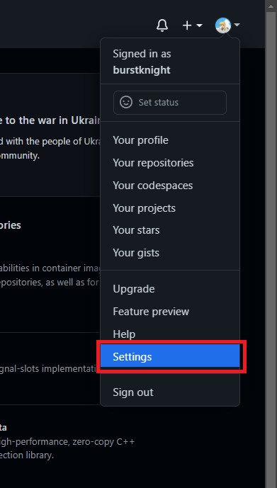

進入設定畫面中，請點選左邊那排的`SSH and GPG keys`：
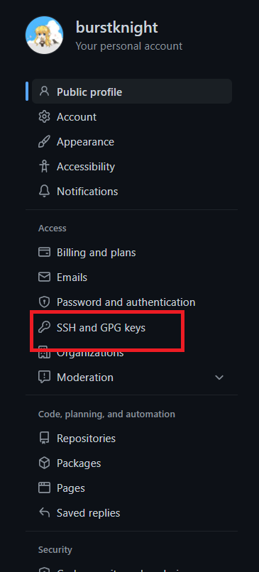

接著，請按下`New SSH key`，來把剛剛產生的金鑰放到GitHub上：
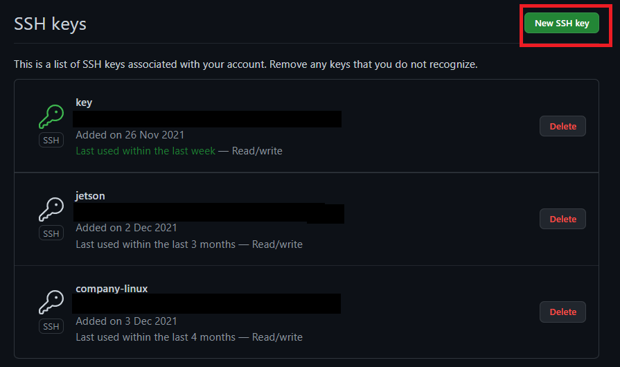

接下來請先在終端機中輸入下面的指令，來確認`id_rsa.pub`的內容：
```bash
$ cat ~/.ssh/id_rsa.pub
ssh-rsa AAAAB3NzaC1yc2EAAAADAQABAAABgQCqDkYLFvuZr1HMYz3Fl/Wv2ALXabC/UM23dOlucJzjk5b38Invv+gtAN2JSNU/G4BUvzcWyQP63/r/bfGex/uHc8fHLEEGjuWGhVP2Q8czqEU3xaVuqWO+X19udwnPpz373b1oOVxQGQqLsWLdu/ykqEjrxjQpkrUhTwngK/Mwrv2xOub+ZKLKWfhlLCSOMiq13YUe+jUhiAXyBrMb9+m7sjnVE+4vd8GsfU9sall2Zli1ncbvzOcGo1TWFoY0sMKgp/eBbAYbIYE6DJUe7EFpxScHb2noA4+jc1HzZ8PaThtaX++l+bRBFj39e68goexV0IWa4p01MyeAEuyfNoStO1geEs1KZ7iXMVBInnRTA2WsK9z1wQ/Lm6uWJ5+/4uQGc+qxoml9BqZdL8akJPdoM/2lfza/Rsan5xIoK0IT2DdLQ/2A7UnvZE+qB2f85WsSFUu0iWkd+rlao9vOiypjKTBSioPpHIpy5dkcG8SLGcCkPGUgjb4esMBP+dTa0/U= JH-06@DESKTOP-CPVBL2K
```
當然，你也可以使用像是Notepad++來讀這個檔案，只要記得檔案的路徑不要搞錯就沒問題。現在請把`id_rsa.pub`這個檔案的內容全部複製起來，記住要複製自己的，不要複製本文的。只要照著前面在GitHub的操作，應該會出現下面的畫面，請把`id_rsa.pb`的內容貼到`Key`下面那一欄，至於`Title`那欄可以隨便填，那只是方便我們管理每個金鑰用的。最後，只要按下`Add SSH key`就設定完成。
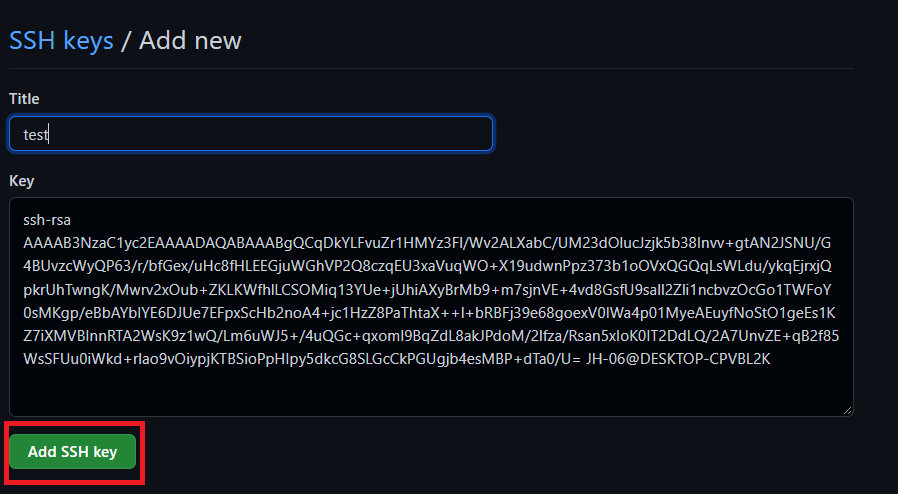

#### 讓GitHub代管專案: `git clone`、`git remote`
讓GitHub代管專案有兩種情況，根據這兩種情況，會有兩種對應的方式。接下來會好好說明這兩種情況，以及如何讓GitHub來代管。

##### 直接從GitHub下載
這個情況是指我們先在GitHub建好一個專案並且下載到自己的電腦上，或是在GitHub瀏覽時，剛好看到有人開發的專案很好用，就想下載來試試看。

現在我們先在GitHub建一個專案，請先登入以後，在右上角使用者帳號旁邊的`+`，如下面圖所示：
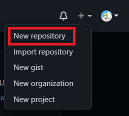

在GitHub上也可以直接按左邊的`New`：
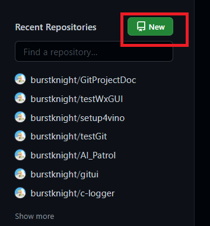

不管使用哪種方式，都會出現下面的畫面。現在來說明在這個畫面由上到下可以設定哪些東西：
- Repository name: 設定儲存庫(專案)名稱，只要不要跟自己已有的儲存庫使用到相同的名稱都可以
- Description: 用來簡單說明這個儲存庫的用途，這個可以不設定
- Public or Private: 這個可以用點擊的方式設定儲存庫的開放權限，如果選擇`Public`，任何人都可以看到我們建立的儲存庫，而選擇`Private`，則只有自己以及得到權限的人才可以看得到
- Initialize this repository with: 這邊用來初始化儲存庫，可依據自己的需求來設定，可選擇的有：
  - Add a README file: 會建出README的說明文件，用來說明這個儲存庫的用途
  - Add .gitignore: 會建出`.gitignore`，而且還可以依照自己的需要，讓GitHub使用預設的範本來把內容填進`.gitignore`中
  - Choose a license: 這個會建出一個文件檔，用來說明其他人用這個專案時的使用範圍

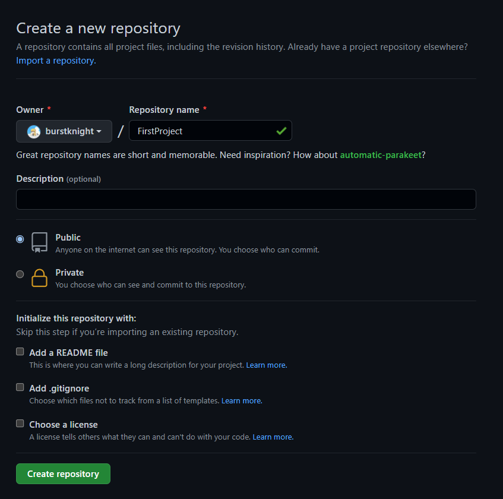

這邊請先照著圖片中來設定專案，然後按下`Create repository`按鈕，就可以成功建出一個專案。這個時候會出現下面的畫面：
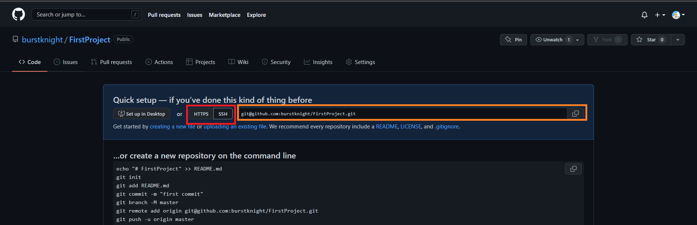

由於我們剛剛在建儲存庫時，初始化那邊沒要求GitHub產生README等檔案，所以才會顯示這個畫面。現在我們還是來說明如何下載專案，在這個圖片中紅框的部分可以設定傳輸的方式，根據選擇的不同，橘框顯示的路徑也會不同，這邊請選擇使用`SSH`來傳輸，稍後將會使用SSH傳輸所對應的路徑。

接下來該來談談Git的指令了，我們可以使用下面的指令從GitHub下載儲存庫：
```bash
$ git clone <url>
# url : 遠端儲存庫的路徑
```
這個指令使用起來很容易，只要把想下載的儲存庫的路徑當參數，就可以從GitHub上下載下來。現在我們先切換適當的目錄，使用這個指令，至於要選擇什麼要的目錄，只要自己覺得適合就好，但最好不會選在其他已經交給Git管控的目錄底下使用這個指令。
```bash
$ git clone git@github.com:burstknight/FirstProject.git
Cloning into 'FirstProject'...
Enter passphrase for key '/c/Users/JH-06/.ssh/id_rsa':
warning: You appear to have cloned an empty repository.
```
這邊要注意一點，如果前面使用`ssh-keygen`設定SSH金鑰時，有設定密碼，我們使用`git clone`下載時，會要求我們輸入密碼。由於這是空的儲存庫，所以在下載時會很快，假如是下載別人的儲存庫，有時會因為那個儲存庫的東西比較多，還有網路的關係，下載時會比較花時間。

由於剛剛建儲存庫的過程中，沒要求GitHub放入README等檔案，會建出一個空的儲存庫。這跟已經有檔案儲存庫在GitHub呈現上不太一樣，所以接下來就以下載Git原始碼來當範例說明。請先進到[這個網站](https://github.com/git/git)。

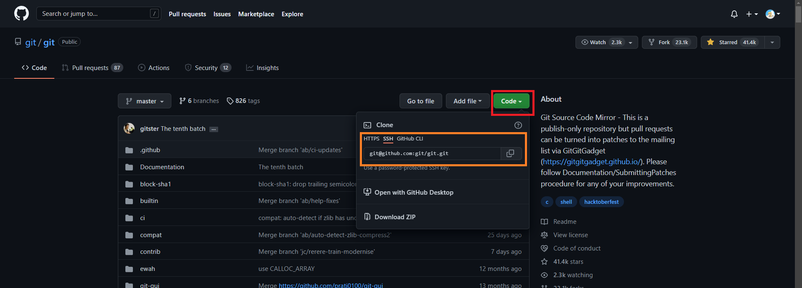

來到Git儲存庫以後，可以點擊`Code`這個按鈕，這個時候就會跳出一個小的對話框。在圖中橘框部分就是可以讓我們取得儲存庫的路徑，這邊點選`SSH`，然後把對應於SSH的路徑複製下來，然後透過`git clone`下載下來：
```bash
$ git clone git@github.com:git/git.git
Cloning into 'git'...
Enter passphrase for key '/c/Users/JH-06/.ssh/id_rsa':
remote: Enumerating objects: 324687, done.
remote: Counting objects: 100% (937/937), done.
remote: Compressing objects: 100% (438/438), done.
remote: Total 324687 (delta 607), reused 706 (delta 499), pack-reused 323750
Receiving objects: 100% (324687/324687), 185.31 MiB | 9.94 MiB/s, done.
Resolving deltas: 100% (242498/242498), done.
Updating files: 100% (4079/4079), done.
```
畢竟Git從2005年開發到現在，儲存庫可能會比較龐大，所以下載時可能會需要一點時間。現在應該知道怎麼從GitHub上下載儲存庫了吧。

##### 交給GitHub代管本機儲存庫
有時只是想寫個小程式做個測試，也有時因為沒網路可用，只能使用指令`git init`在自己的電腦建出儲存庫來管理專案。後來想想應該把這些儲存庫放到GitHub，這個時候就可以使用本小節的方法。

請參考上一小節的內容在GitHub建出一個不包含任何檔案的儲存庫`testGit`。
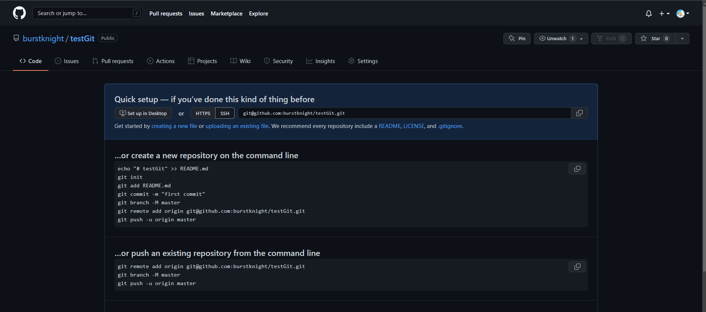

現在我們試著把從本文一開始就做的儲存庫`testGit`跟GitHub上的`testGit`連結起來。這邊要介紹一個指令可讓我們在本機中的儲存庫與GitHub連結起來：
```bash
$ git remote add <remote_name> <url>
# <remote_name> : 遠端儲存庫的名稱
# url           : 遠端儲存庫的路徑
```
比較需要提的是，`<remote_name>`代表了後面接的那串路徑，一般來說，`<remote_name>`習慣上都會使用`origin`，不過因為它只是讓我們不用職解使用遠端儲存庫的路徑，而是使用這個比較短的文字來跟遠端儲存庫同步，所以這個名稱可以隨意取。當然，如果用一陣子不喜歡當初取的名稱，也之後可以改，這個部分稍後再提。

現在我們來使用這個指令來讓本機的`testGit`與GitHub上的儲存庫連結起來：
```bash
$ git remote add git@github.com:burstknight/testGit.git
```
現在我們來確認看看本機的儲存庫`testGit`是否跟GitHub上面的儲存庫連結上了。可以使用下面的指令來確認：
```bash
$ git remote -v
# -v  : 用來顯示所有遠端儲存庫

$ git remote -v
origin  git@github.com:burstknight/testGit.git (fetch)
origin  git@github.com:burstknight/testGit.git (push)
```
當我們使用`git remote -v`就可以查看本機儲存庫中所有的遠端儲存庫。這邊要稍微解釋一下，`git remote -v`回報的訊息一定是兩行為一組，這兩行最右邊圓括號的`fetch`與`push`分別代表我們下載與上傳的路徑設定。

接下來介紹一下兩個比較進階的用法。剛剛有提到，使用`git remote add`可以讓本機的儲存庫與遠端儲存庫連結起來，也有提到遠端儲存庫的名稱可以更改，這邊就來說明遺下該如何修改：
```bash
$ git remote rename <old_remote_name> <new_remote_name>
# <old_remote_name> : 舊的遠端儲存庫的名稱
# <new_remote_name> : 新的遠端儲存庫的名稱


# 再新增一個遠端儲存庫來測試重新命名
$ git remote add github git@github.com:burstknight/testGit.git

$ git remote -v
github  git@github.com:burstknight/testGit.git (fetch)
github  git@github.com:burstknight/testGit.git (push)
origin  git@github.com:burstknight/testGit.git (fetch)
origin  git@github.com:burstknight/testGit.git (push)

$ git remote rename github hello

$ git remote -v
hello   git@github.com:burstknight/testGit.git (fetch)
hello   git@github.com:burstknight/testGit.git (push)
origin  git@github.com:burstknight/testGit.git (fetch)
origin  git@github.com:burstknight/testGit.git (push)
```
對遠端儲存庫名稱重新命名很容易，只要使用`git rename`就可以達成。現在來說明一下剛剛的範例，首先我們使用`git remote add`新增一個遠端儲存庫，名稱使用`github`，並且使用`git remote rename`把遠端儲存庫的名稱`github`改成`hello`，而且在使用`git remote rename`前後透過`git remote -v`確認是否成功把遠端儲存庫`github`改名。

我們來試試看把剛剛新增的儲存庫移除掉，可以使用下面的指令來達成：
```bash
$ git remote remove <remote_name>
# <remote_name> : 欲刪除遠端儲存庫的名稱


$ git remote remove hello

$ git remote -v
origin  git@github.com:burstknight/testGit.git (fetch)
origin  git@github.com:burstknight/testGit.git (push)
```
`git remote remove`可以把遠端儲存庫從本機的儲存庫中移除，不過這只是解決連結，實際上並不會刪掉在GitHub上的儲存庫。

最後，要提醒一下，使用`git remote add`只是把本機的儲存庫與遠端儲存庫連結起來。做完這個小節的範例以後，如果你用網頁瀏覽器看GitHub的儲存庫，會發現那上面的儲存庫還是空的，這是因為到目前為止都還沒把本機儲存庫同步到遠端儲存庫的緣故。後面提到`git push`和`git fetch`，這兩個指令可以幫我們同步。

#### 上傳至GitHub: `git push`
現在來介紹指令`git push`，這個指令的功能為把本機儲存庫中的分支上傳到遠端儲存庫上。在遠端協作中，這是最常用的指令之一，這個指令的用法如下：
```bash
$ git push [-d] <remote_name> [<local_branch>:]<remote_branch>
# -d  : 刪除遠端儲存庫的分支
# <remote_name>   : 遠端儲存庫名稱
# <local_branch>  : 本機儲存庫的分支，若與遠端儲存庫分支相同名稱，可以標明
# <remote_branch> : 遠端儲存庫的分支
```
如果只用`git push`，只會把目前所使用的分支的修改紀錄都上傳到遠端儲存庫。此外，假如本機儲存庫的分支與遠端儲存庫的分支使用相同的名稱，可以省略掉`<local_branch>:`。若使用`git push -d`則是把遠端儲存庫的分支刪除掉。切記，使用`git push`上傳時，請不要使用`git push <remote_name> :<remote_branch>`，重點是那個`:`符號，這個指令可以解釋成把空的分支上傳到上去，並且對應於遠端分支`<remote_branch>`，這相當於使用`git push -d`刪除遠端分支。

我們來試著把分支`master`上傳到GitHub：
```bash
$ git checkout master
Already on 'master'

$ git push origin master
Enter passphrase for key '/c/Users/JH-06/.ssh/id_rsa':
Enumerating objects: 36, done.
Counting objects: 100% (36/36), done.
Delta compression using up to 16 threads
Compressing objects: 100% (29/29), done.
Writing objects: 100% (36/36), 3.22 KiB | 824.00 KiB/s, done.
Total 36 (delta 9), reused 0 (delta 0), pack-reused 0
remote: Resolving deltas: 100% (9/9), done.
To github.com:burstknight/testGit.git
 * [new branch]      master -> master
```
在這個範例中，會先使用`git checkout`是為了確保已經在分支`master`。當我們使用`git push`時，假如之前設定SSH金鑰時有設定密碼，在這邊上傳的過程中就會要求我們輸入密碼。由於遠端儲存庫中不存在分支`master`，所以在上傳的過程中會幫我們在遠端儲存庫建出分支，然後把本機儲存庫的分支`master`所有的修改紀錄都會上傳上去。如果我們用網頁瀏覽器去看儲存庫`testGit`，就會發現剛剛的操作真的上傳成功。還要提醒一下，假如網頁瀏覽器到剛剛上傳為止都停留在儲存庫`testGit`，請按F5鍵更新一下，因為即使GitHub已經收到上傳的東西，也不會主動幫我們更新網頁瀏覽器的畫面。

這邊還有一點要提一下，當我們使用`git push`或後面提到的`git fetch`同步儲存庫時，Git會在本機儲存庫中做出遠端儲存庫的分支。這麼做是為了讓我們可以確認在本機儲存庫是否已經更新到遠端儲存庫中。確認的方式為使用指令`git log`：
```bash
$ git log --graph
* commit 464fb14f19a5525a97b1042a444f15e6f7efc71f (HEAD -> master, origin/master)
| Author: Joe <joe@email.tw>
| Date:   Fri Mar 11 17:08:40 2022 +0800
|
|     Update color.txt
|
* commit 9497eaf1fba0313a9f2b35fa78911711d1029b9a (tag: show, tag: light-tag, tag: cat, tag: ann-tag)
| Author: Joe <joe@email.tw>
| Date:   Thu Mar 10 17:13:14 2022 +0800
|
|     Update hello.c
|
* commit 64becd2ed4ee1d24854df55a3bcf3bdea52dce04
| Author: Joe <joe@email.tw>
| Date:   Thu Mar 3 17:48:19 2022 +0800
|
|     Add hello.c
|
*   commit 65e497e3b11e3bcc75aa9c8799c0df017cc754fa
|\  Merge: 8d0a25f 90bdb96
| | Author: Joe <joe@email.tw>
:
# 以下省略
```
在我們使用`git push`之前，最新的修改紀錄中只有分支`master`。可是在我們上傳完以後，就多了一個分支`origin/master`，這個就是遠端儲存庫的分支，其中那個`origin`就是在本機中遠端儲存庫的名稱。

現在來談談刪除遠端儲存庫的分支。前面有提到可以使用`git push -d`來刪除遠端儲存庫的分支，當然這個分支必須是存在的。我們來想像一個情境來搭配`git push -d`來使用，首先我們上傳分支`test`：
```bash
$ git checkout test
Switched to branch 'test'

$ git push origin test
Enter passphrase for key '/c/Users/JH-06/.ssh/id_rsa':
Total 0 (delta 0), reused 0 (delta 0), pack-reused 0
remote:
remote: Create a pull request for 'test' on GitHub by visiting:
remote:      https://github.com/burstknight/testGit/pull/new/test
remote:
To github.com:burstknight/testGit.git
 * [new branch]      test -> test

$ git log
commit 90bdb96a6e365605d127f985cc6ddec765a23845 (HEAD -> test, origin/test)
Author: Joe <joe@email.tw>
Date:   Thu Mar 3 15:33:22 2022 +0800

    Add color.txt

commit e878e12d1b408d8df3e85464b4cd748e8fc1db4d
Author: Joe <joe@email.tw>
Date:   Thu Mar 3 15:31:50 2022 +0800

    Add new.txt

commit 8d0a25fc3a80cf1bea78003c7df1697dc4ea3855
Author: Joe <joe@email.tw>
Date:   Mon Feb 21 17:04:12 2022 +0800

    Add test.txt

commit 7f707c650e3b3c9cafeebbc63f309a04057e542d
Author: Joe <joe@email.tw>
Date:   Fri Feb 18 10:43:01 2022 +0800

    Add .gitignore
:
# 以下省略
```
在上傳完以後，用`git log`確認剛剛上傳成功。這個時候去用網頁瀏覽器看儲存庫，會發現多了一個分支`test`。假設我們希望遠端儲存庫的分支`test`改成其他名稱，比方說是`car`。在這種情況下，我們先把遠端分支`test`刪除掉：
```bash
$ git push -d origin test
Enter passphrase for key '/c/Users/JH-06/.ssh/id_rsa':
To github.com:burstknight/testGit.git
 - [deleted]         test

$ git log
commit 90bdb96a6e365605d127f985cc6ddec765a23845 (HEAD -> test)
Author: Joe <joe@email.tw>
Date:   Thu Mar 3 15:33:22 2022 +0800

    Add color.txt

commit e878e12d1b408d8df3e85464b4cd748e8fc1db4d
Author: Joe <joe@email.tw>
Date:   Thu Mar 3 15:31:50 2022 +0800

    Add new.txt

commit 8d0a25fc3a80cf1bea78003c7df1697dc4ea3855
Author: Joe <joe@email.tw>
Date:   Mon Feb 21 17:04:12 2022 +0800

    Add test.txt

commit 7f707c650e3b3c9cafeebbc63f309a04057e542d
Author: Joe <joe@email.tw>
Date:   Fri Feb 18 10:43:01 2022 +0800

    Add .gitignore
:
# 以下省略
```
當我們刪除遠端儲存庫的分支`test`時，再去察看一次歷史紀錄，會發現遠端分支`origin/test`消失了。當然，GitHub上的儲存庫也不存在分支`test`。接著，我們再上傳一次，可是這次遠遠端分支名稱是`car`：
```bash
$ git push origin test:car
Enter passphrase for key '/c/Users/JH-06/.ssh/id_rsa':
Total 0 (delta 0), reused 0 (delta 0), pack-reused 0
remote:
remote: Create a pull request for 'car' on GitHub by visiting:
remote:      https://github.com/burstknight/testGit/pull/new/car
remote:
To github.com:burstknight/testGit.git
 * [new branch]      test -> car
```
假如去看GitHub的儲存庫，會發現多了一個分支`car`。這裡要注意，之前使用`git push`上傳時，由於本機儲存庫的分支與遠端儲存庫的分支的名稱相同，所以只需要在這個指令後面直接輸入跟欲上傳分支相同名稱即可。然而，這次上傳分支`test`在遠端儲存庫中對應於分支`car`，而且遠端分支`car`不存在，所以後面才要用`:`來做個對應。

一般來說，像剛剛那個範例比較不會使用，因為還要記得本機儲存庫的分支對應到遠端儲存庫的哪一個分支，用起來也比較麻煩。如果要重新命名遠端分支，建議先使用`git branch -m`把本機儲存庫的分支更改名稱，然後再把遠端儲存庫那個舊的分支刪掉，最後才使用`git push`上傳更改後的分支到GitHub上。

#### 下載來更新本機儲存庫: `git fetch`
上一小節我們學會了怎麼上傳到GitHub，現在該來學習怎麼從GitHub下載來更新本機儲存庫。我們可以使用指令`git fetch`來更新本機儲存庫，這個指令的用法如下：
```bash
$ git fetch [remote_name]
# remote_name : 遠端儲存庫的名稱，這會下載在這個遠端儲存庫中所有的分支
```
如果我們只使用`git fetch`，就只會下載目前本機所使用之分支所對應的分支。若在這個指令後面加上遠端儲存庫的名稱，則會把該遠端儲存庫所有的分支下載下來。

說了這麼多可能還是不知道怎麼使用，現在我們試試看使用`git fetch`：
```bash
$ git chechout master
Switched to branch 'master'

$ git fetch
Enter passphrase for key '/c/Users/JH-06/.ssh/id_rsa':
```
畢竟GitHub上那個儲存庫只有我們自己在管理，而且那上面的修改進度跟本機一樣，所以使用`git fetch`當然沒有東西可以下載。我們在GitHub上修改檔案，來模擬遠端儲存庫有新的內容可以更新到本機。如下面的畫面，請注意橘框要顯示`master`，這代表我們目前使用分支`master`，然後直接點擊檔案`test`。
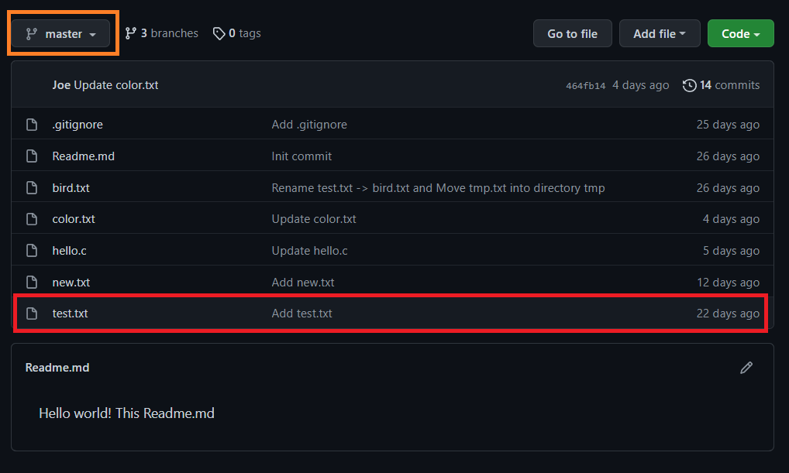

這個時候會進入下面的畫面，在這個畫面中我們可以查看檔案`test.txt`的內容。接下來請點選畫面中那個像鉛筆的圖案，它可以讓我們編輯檔案。
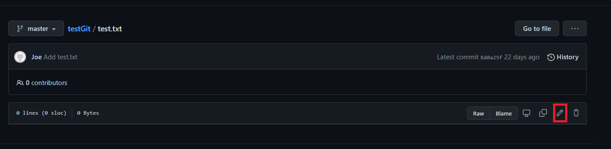

我們可以在下面的畫面中紅框的區域編輯這個檔案的內容。請照著下面的圖片來編輯檔案的內容。
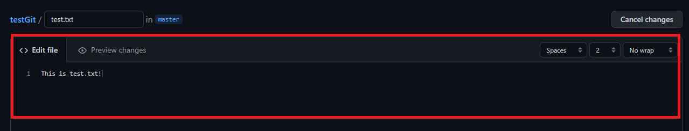

接下來請把網頁瀏覽器滑到底下，就會出現下面的對話框。這個對話框有點像是指令`git add`與`git commit`的結合，我們透過網頁編輯檔案，然後在這個對話框中輸入這次修改了哪些東西，以及為何要修改。紅框用來輸入這次提交訊息的標題，而綠框用來更詳細說明這次修改的狀況，當然這個也可以什麼都不輸入，最後只要按下橘框那個`Commit changes`的按鈕，就可以儲存這次的修改。請照著下面的圖片來輸入提交訊息的內容，然後儲存這次的修改。
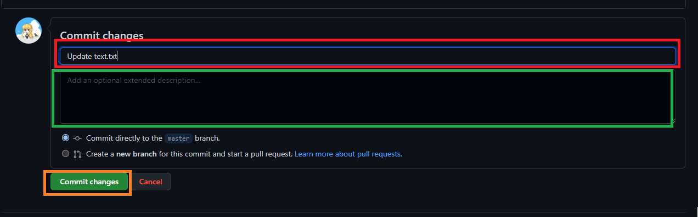

現在來到重頭戲了，我們試著使用`git fetch`，看看本機儲存庫會發生什麼事：
```bash
$ git fetch
Enter passphrase for key '/c/Users/JH-06/.ssh/id_rsa':
remote: Enumerating objects: 5, done.
remote: Counting objects: 100% (5/5), done.
remote: Compressing objects: 100% (2/2), done.
remote: Total 3 (delta 1), reused 0 (delta 0), pack-reused 0
Unpacking objects: 100% (3/3), 646 bytes | 5.00 KiB/s, done.
From github.com:burstknight/testGit
   464fb14..5dc2f1e  master     -> origin/master

$ git log
commit 464fb14f19a5525a97b1042a444f15e6f7efc71f (HEAD -> master)
Author: Joe <joe@email.tw>
Date:   Fri Mar 11 17:08:40 2022 +0800

    Update color.txt

commit 9497eaf1fba0313a9f2b35fa78911711d1029b9a (tag: show, tag: light-tag, tag: cat, tag: ann-tag)
Author: Joe <joe@email.tw>
Date:   Thu Mar 10 17:13:14 2022 +0800

    Update hello.c

commit 64becd2ed4ee1d24854df55a3bcf3bdea52dce04
Author: Joe <joe@email.tw>
Date:   Thu Mar 3 17:48:19 2022 +0800

    Add hello.c

commit 65e497e3b11e3bcc75aa9c8799c0df017cc754fa
Merge: 8d0a25f 90bdb96
Author: Joe <joe@email.tw>
Date:   Thu Mar 3 15:35:58 2022 +0800
:
# 以下省略
```
當我們使用`git fecth`以後，它會回報說已經從GitHub下載完成，可是我們使用`git log`查看時卻發現怎麼剛剛在網頁上的修改沒更新到本機的分支`master`。

會有這個狀況是因為`git fetch`的處理機制。實際上Git會在儲存庫中建出分支`origin/master`來代表遠端儲存庫的分支`master`。當我們使用`git fetch`，這相當於更新本機儲存庫的分支`origin/master`，而分支`master`則不影響。如果我們希望讓本機儲存庫的分支`master`可以更新，可以使用`git merge`來把分支`origin/master`合併過來。
```bash
$ git merge origin/master
Updating 464fb14..5dc2f1e
Fast-forward
 test.txt | 1 +
 1 file changed, 1 insertion(+)
```
我們使用`git merge`而不使用`git merge --no-ff`的原因在於，這兩個分支本來就是同一個分支，既然如此就沒必要透過`git merge --no-ff`來保留分支`origin/master`的樣子。

換句話說，我們透過`git fetch`下載遠端儲存庫的最新修改紀錄，之後還需要使用`git merge`來更新本機儲存庫的每個分支才行。`git fetch`之所以要用這種比較麻煩的方式來更新本機儲存庫的原因在於，假如我們在使用的儲存庫是在GitHub上某人的專案，我們自己開發時發現原作者已經更新了，這個時候就可以先用`git fetch`下載原作者的更新狀況來確認有哪些東西已經修改過了。假如確定沒什麼問題，當然就可以使用`git merge`把原作者修改的東西合併過來。

也許你會想問，`git fetch`和`git clone`有什麼區別？這兩者的確都是從GitHub下載遠端儲存庫，但是使用的時機不同。當我們想要使用的專案不在自己的電腦時，就會使用`git clone`來下載，也就是說這個指令只會使用一次。至於`git fetch`，這個通常是用在更新，所以在使用完`git clone`以後，就可能會經常使用到。